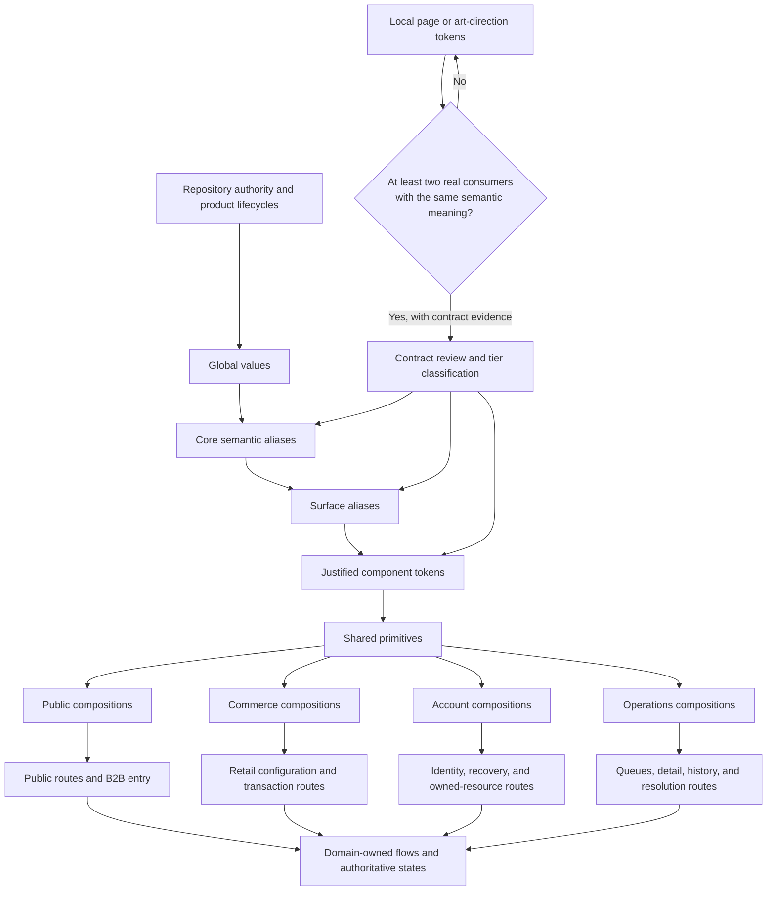
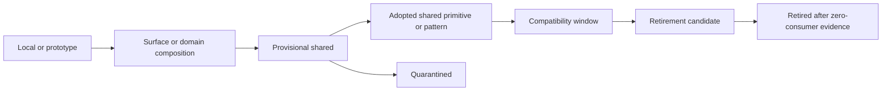

# Design Brief: Niuva Frontend Experience and Design-System Blueprint

**Status:** Candidate — Context Only — Phase 2 owner-approved direction; not
canonical and not implementation authority

**Date:** 17 August 2026

**Repository baseline:** `origin/main`
`8555685c29a3fde9976ae6499336e2eb45a330ba`

**Scope:** The complete frontend experience across Public, Commerce, Account,
and Operations, including active routes, compatibility aliases, prototypes,
shared primitives, surface/domain compositions, user flows, visible states,
and future design iteration.

**Owner decision:** The owner approved this Phase 2 brief as blueprint direction
on 18 August 2026, approved the resulting Phase 3 Information Architecture,
approved Phase 4 `TOK-01` through `TOK-12`, and separately authorized
preparation of the Phase 5 task plan. Those approvals do not authorize Phase 6,
canonical promotion, source work, or any delivery gate.

## 1. Problem

Niuva already has an approved NDS 2.0 direction, a working semantic CSS
registry, reusable UI primitives, and many active routes. It does not yet have
one reviewable blueprint that connects all of the following:

- product and lifecycle authority;
- route and user-flow responsibilities;
- token tiers and promotion boundaries;
- shared primitive behavior and surface-native composition;
- component adoption, compatibility, quarantine, and retirement status;
- page-level information architecture and future wireframes;
- visible, recovery, permission, uncertain, and success states; and
- safe visual iteration without silently changing business behavior.

Without that blueprint, improving one page at a time can create either a
generic universal template or several unrelated component libraries. It also
makes visual experimentation harder to distinguish from a durable system
contract.

## 2. Proposed solution

Create a versioned Frontend Experience and Design-System Blueprint that uses:

1. one shared primitive layer for interaction, API continuity, baseline state,
   and accessibility;
2. four surface-native composition layers for Public, Commerce, Account, and
   Operations;
3. domain-owned lifecycle meaning, recovery, permission, persistence, and
   authoritative success;
4. purpose-based global, core, and surface tokens with local art-direction
   tokens kept outside the shared contract until promotion evidence exists;
5. one responsive layout foundation with controlled surface-specific breaks;
6. explicit component status, promotion, versioning, deprecation, and rollback
   rules; and
7. phased route, flow, wireframe, visual, prototype, and migration work.

This is a system for making later decisions. It is not a final palette, a page
redesign, a Storybook installation, a component-library rewrite, or a source
migration.

## 3. Blueprint at a glance



The diagram expresses dependency and ownership, not a runtime package graph.
Route pages remain responsible for data, permissions, mutations, and
orchestration.

## 4. Primary users and jobs to be done

### 4.1 Public and B2B visitor

- Understand what Niuva does and how the four equal Services relate to a need.
- Evaluate truthful project evidence without fabricated claims.
- Choose a B2B inquiry or Retail path without confusing their lifecycles.
- Submit an Inquiry with consent, receive its real UUID after persistence, and
  optionally continue to WhatsApp by explicit user action.

### 4.2 Retail customer

- Discover a published product or service, configure it safely, and understand
  which values are provisional versus server-authoritative.
- Authenticate before private upload or authoritative checkout.
- Continue to direct checkout only when eligible, or retain context through
  `quote_required` without creating an Order, reservation, payment attempt, or
  checkout total.

### 4.3 Account customer

- Authenticate, recover access, and act on owned records.
- Understand current state, privacy boundaries, next action, conflict, expiry,
  and recovery without seeing internal data.

### 4.4 Operations user

- Scan role-appropriate queues, understand ownership and age, resolve domain
  states, review history, and recover from conflict or dependency failure.
- Work with higher density without inheriting Public campaign composition or
  fake dashboard metrics.

### 4.5 Designer, developer, reviewer, and AI agent

- Find the authoritative token, component, state, flow, and surface owner.
- Know whether an artifact is adopted, provisional, quarantined,
  compatibility-only, prototype-only, or a retirement candidate.
- Iterate locally, compare options, and promote only the selected contract with
  consumer, accessibility, migration, and rollback evidence.

## 5. Success definition

The blueprint succeeds when later phases can demonstrate that:

- every active route family and material user flow has a surface and domain
  owner;
- compatibility aliases, reserved paths, and prototypes are inventoried but
  not mistaken for active design authority;
- every shared component proposal has an adoption status and the NDS 13-field
  contract before migration;
- route pages consume semantic roles through the approved dependency direction
  rather than introducing a parallel token runtime;
- visual differences between surfaces follow task purpose, not arbitrary
  duplication;
- all relevant visible, error, conflict, recovery, uncertain, permission, and
  success states are designed before a slice is called complete;
- owner-reviewed visual iteration remains possible without changing routes,
  authorization, lifecycle, factual content, or business rules; and
- source work is split into reversible, exact-file migration slices with
  proportional tests and browser evidence.

Phase 2 itself succeeds when this brief captures the agreed system boundaries
without changing application source or promoting candidate direction.

## 6. Experience principles

1. **Shared meaning, surface-native expression.** Reuse interaction,
   accessibility, and semantic contracts; let each surface compose them for
   its real task instead of using one universal template.
2. **Truth and recovery before persuasive convenience.** Persistent success,
   permission, price, availability, and lifecycle meaning follow authoritative
   domain evidence. Important feedback is visible and recoverable.
3. **Iterate locally, promote with evidence.** Art direction may change. A
   local choice becomes shared only when repeated consumers need the same
   semantic contract and migration remains reversible.

## 7. Aesthetic direction

### 7.1 Philosophy

**One Niuva identity, surface-native composition.** This phrase describes a
working principle, not a new brand name or canonical art direction.

### 7.2 Surface registers

<!-- markdownlint-disable MD013 -->

| Surface | Intended character | Composition responsibility | Must avoid |
| --- | --- | --- | --- |
| Public | Persuasive, evidence-led, editorial, authentic | Positioning, four equal Services, project evidence, route choice, B2B inquiry entry | Generic SaaS composition, fabricated evidence, Commerce or Admin state metaphors |
| Commerce | Precise, specification-first, confidence-building | Product/configuration hierarchy, eligibility, account boundary, authoritative transaction feedback | Public campaign rhythm, guest-checkout implication, invented totals or provider success |
| Account | Calm, private, task-first | Identity, recovery, owned records, next action, customer-safe status | Public conversion motifs, internal detail, Admin density |
| Operations | Dense but calm, scannable, audit-safe | Queues, ownership, age, status, conflict, history, permission, recovery | Fake KPI, bento decoration without task hierarchy, Public storytelling motifs |

<!-- markdownlint-enable MD013 -->

### 7.3 Cross-surface identity

- Use the official Niuva mark and existing identity authority.
- Mona Sans Variable is the active shared sans role.
- Bona Nova Italic remains a narrowly bounded Public-only expressive role, at
  most once in a composition where authority permits it.
- System monospace is reserved for genuine identifiers, hashes, measurements,
  or machine values.
- Niuva blue remains purposeful identity, action, and focus support; semantic
  status meaning must remain independent.
- Prefer hierarchy, typography, content, spacing, and authentic media over
  decorative gradients, glass effects, fake telemetry, or repeated card grids.

This brief does not select a replacement Homepage signature visual. The
owner-approved FDM retirement direction remains candidate-only until its
canonical conflict is separately resolved.

## 8. Existing implementation vocabulary

The blueprint must extend current, verified source rather than invent a second
frontend foundation.

### 8.1 Runtime and tooling

- React 19 and React Router 7;
- Create React App with CRACO;
- Tailwind CSS 3.4 mapped to semantic CSS custom properties;
- Radix-based wrappers, CVA, Lucide, and Sonner;
- Axios and Zod at application boundaries;
- bounded GSAP support and Recharts where current consumers justify them; and
- Jest/Testing Library through the existing frontend test foundation.

There is no current Storybook or token-JSON runtime. Neither is introduced by
this brief. `frontend/src/index.css` remains the runtime custom-property source
of truth and `frontend/tailwind.config.js` remains a mapping consumer.

### 8.2 Current route evidence

Current source declares 59 concrete `path="..."` route entries plus one mapped
alias declaration covering eight Public compatibility aliases. The complete
source-bound inventory is recorded in the
[cross-surface audit](../../docs/implementation/audits/2026-08-17-cross-surface-design-token-inventory.md).

<!-- markdownlint-disable MD013 -->

| Route family | Examples | Blueprint treatment |
| --- | --- | --- |
| Public localized | `/`, `/en`, `/tentang`, `/layanan`, `/proyek`, `/kontak`, `/faq`, `/privasi`, `/retail` and English pairs | Include in IA, flow, wireframe, content/state, and visual review |
| Retail and Customer | `/retail/products/:slug`, `/dashboard`, `/order`, `/orders/:id` | Include account, configuration, file, price, checkout/quote, owned-record, and recovery boundaries |
| Authentication | `/login`, `/admin/login`, invitation and password-recovery routes | Separate customer, staff, and recovery audiences while sharing safe primitives |
| Operations/Admin | `/admin` and catalog, materials, inventory, portfolio, content, Inquiry, B2B, Retail Order, user, customer, notification, communication, and settings routes | Group by operational job and lifecycle, not by one dashboard template |
| Prototype | gated `__brand-lab` routes | Record as evidence only; no automatic adoption or activation |
| Compatibility/reserved | eight Public aliases and reserved project-detail prefixes | Record ownership and destination; do not redesign, activate, or remove implicitly |
| Not found | wildcard `*` | Include recovery, locale, route ownership, and safe next action |

<!-- markdownlint-enable MD013 -->

### 8.3 Current component evidence

The existing component register remains the source of current adoption
evidence. This brief carries its statuses forward without promoting them.

<!-- markdownlint-disable MD013 -->

| Current status | Current examples | Blueprint rule |
| --- | --- | --- |
| Adopted shared primitives | `Button`; `Input`, `Textarea`, `Label`, `FormField`; `Select`, `Switch`, `Tabs`; `Dialog`, `AlertDialog`; `Table`; `Alert`; skeletons; Sonner; state components; `SurfacePanel`; restricted `TechnicalLabel`; presentation-only `Badge` | Preserve API and accessibility; document variants, states, consumers, and surface restrictions before migration |
| Provisional, unused | `Progress`, `ResponsiveTable`, `Separator`, `StatCard`, `Tooltip` | File existence is not adoption; validate a real consumer and full contract first |
| Quarantined, unused | `Drawer` | Do not import, install its undeclared dependency, promote, or delete without a separate decision |
| Surface/domain compositions | Marketing components, `AuthShell`, `RetailProductVisual`, legacy operational status components, lifecycle-owned badges, Public/Operational navigation, Admin feature components | Keep surface and lifecycle boundaries explicit; do not generalize appearance into shared authority |

<!-- markdownlint-enable MD013 -->

## 9. Approved token-system boundary

### 9.1 Token chain

```text
global values
  -> core semantic aliases
  -> surface aliases
  -> justified component tokens
  -> shared primitives
  -> surface/domain compositions
  -> route pages
```

### 9.2 Token tiers

<!-- markdownlint-disable MD013 -->

| Tier | Owns | Promotion boundary |
| --- | --- | --- |
| Global | Raw tonal ramps, spacing steps, radii, duration/easing values, and other foundation values | Foundation-owned; route pages must not consume raw values directly |
| Core semantic | Purpose-based surface, text, action, status, boundary, focus, layout, elevation, and motion roles | Must remain independent of one route or visual campaign |
| Surface | Public, Commerce, Account, or Operations interpretation of core roles | May tune expression and density; cannot change lifecycle meaning |
| Component | A repeated role required by one shared component contract | Requires demonstrated reuse and the NDS 13-field specification |
| Local | Page, experiment, art-direction, or one-off composition values | Stays local until at least two real consumers use the same semantic meaning |

<!-- markdownlint-enable MD013 -->

The two-consumer rule is necessary but not sufficient. Promotion also requires
an owner, accessible states, responsive and localization evidence, API impact,
consumer inventory, migration notes, and rollback.

### 9.3 Role families

- surface and layer;
- text and technical value;
- action and selection;
- status and feedback;
- border, divider, focus, and scrim;
- typography;
- spacing, container, and prose measure;
- shape and radius;
- elevation and stacking;
- motion duration, easing, and reduced behavior.

Status color is presentation only. It never creates a shared Inquiry, Request,
Offer, Order, payment, Quote, Project, Work Order, or authentication state
machine.

## 10. Approved layout-system boundary

Use one alignment foundation:

- 4-column mobile, 8-column intermediate, and 12-column desktop alignment;
- a 4px base spacing rhythm;
- representative horizontal gutters of 16px, 24px, and 32px as the viewport
  grows;
- semantic containers, prose measures, spacing, and stacking roles; and
- review widths of 320, 390, 768, 1024, and 1440px.

The grid is an alignment tool, not a universal page template. Public may use
editorial asymmetry and bounded full bleed; Commerce prioritizes product and
configuration hierarchy; Account prioritizes focused tasks; Operations may
use denser tables, split panes, and bounded overview grids. Every intentional
grid break must preserve reading order, focus order, reflow, and critical
actions.

## 11. Approved component-system boundary

### 11.1 Layer model

1. **Shared primitive layer:** interaction API, baseline state, keyboard,
   touch, focus, screen-reader behavior, and semantic token consumption.
2. **Shared composed patterns:** only when several surfaces repeat the same
   semantic task. Search remains a composed pattern candidate, not an
   automatically universal primitive.
3. **Surface-native composition:** Public, Commerce, Account, and Operations
   own layout, density, content conventions, imagery, and local expression.
4. **Domain composition:** owns lifecycle labels, permissible actions,
   recovery, privacy projection, and authoritative state meaning.
5. **Route page:** owns data, permission, route, mutation, and orchestration.

### 11.2 NDS 13-field minimum

Every component or composition proposed for adoption must record:

1. name, purpose, owner, and adoption status;
2. when to use and not use;
3. anatomy and required or optional elements;
4. variants, sizes, and content limits;
5. props/API continuity or breaking change;
6. interaction and data states;
7. mouse, keyboard, touch, focus, and screen-reader behavior;
8. responsive and overflow behavior;
9. token dependencies;
10. localization and long-content behavior;
11. surface and domain restrictions;
12. anti-patterns; and
13. migration and deprecation notes.

### 11.3 Status and promotion



- **Prototype:** review evidence only; no implementation authority.
- **Provisional:** a candidate with bounded consumers; not yet a general
  default.
- **Adopted:** reviewed contract with real consumers, owner, verification, and
  maintenance responsibility.
- **Quarantined:** unsafe, undeclared, conflicting, or incomplete; no new
  consumer.
- **Compatibility:** retained temporarily for existing consumers; no new
  consumer and a named replacement is required.
- **Retirement candidate:** removal is proposed but requires consumer,
  historical-evidence, migration, and rollback review.

Promotion requires at least two real consumers with the same semantic meaning,
no lifecycle-authority leakage, the NDS 13 fields, accessibility and state
evidence, responsive and localization checks, migration notes, and rollback.
Two visually similar uses with different business meaning do not qualify.

## 12. Shared state grammar and domain ownership

Shared presentation contracts cover:

- default/ready, hover, focus, active, selected/current, and disabled;
- loading/bootstrap and empty;
- validation and system/dependency errors;
- conflict/stale, permission/forbidden, expired, and offline/unavailable;
- uncertain, recovery, and success.

The shared layer owns how a state is perceivable and operable. The domain owns
the copy, reason, permissible recovery, lifecycle meaning, privacy projection,
and authoritative success. Critical feedback must remain visible in-page; a
toast or live region may reinforce it but cannot be its only representation.

## 13. Key user-flow contracts

### 13.1 Public B2B inquiry

```text
Public Contact form without login
  -> preserve values during client validation
  -> persistence attempt
  -> Inquiry persisted as `new`
  -> visible acknowledgement with the existing Inquiry UUID
  -> optional user-clicked WhatsApp continuation
  -> manual Operations triage and follow-up
```

No public raw-file upload, automatic WhatsApp, fabricated success, Quote or
Project creation, price, ETA, or delivery guarantee is implied.

### 13.2 Retail transaction and quote routing

```text
Public discovery and non-sensitive configuration
  -> account boundary before private upload or authoritative checkout
  -> server revalidation
  -> eligible direct-checkout path
     OR
     `quote_required` context handoff
```

`quote_required` creates no Order, reservation, payment attempt, paid state,
or checkout total. Mixed-cart handling, file version, contact, fulfillment
context, and reason codes remain domain-owned.

### 13.3 Account identity and recovery

Customer and staff authentication may share safe form primitives but keep
audience, destination, permission, privacy, invitation, expiry, and recovery
meaning separate. `/register` and external identity providers remain inactive
unless separately approved.

### 13.4 Operations processing

Operations pages expose only role-authorized queues and data. Route visibility
is not authorization. Queue, detail, history, conflict, and recovery patterns
must preserve each domain's lifecycle rather than flattening them into a
universal status component.

### 13.5 Locale continuity

Indonesian is primary. Public ID/EN pairs follow approved route ownership.
Changing language preserves exact counterpart or owned-resource context; it
must not invent `/en` variants for retained unprefixed private routes.

## 14. Motion, donor components, and bounded bento use

### 14.1 Motion contract

- Keep feedback and state motion within the Niuva grammar and preserve reduced
  behavior.
- CSS is the default; use current bounded GSAP support only when an approved
  Public choreography needs it.
- Motion must explain hierarchy, continuity, feedback, process, or media
  state. It cannot carry required meaning alone.
- Avoid scroll hijacking, universal reveals, hover-only information, motion on
  every section, and ornamental animation that delays tasks.

### 14.2 React Bits, Magic UI, and other donors

External examples may enter review at one of three levels:

1. **Reference only:** a visual or interaction idea, with no copied code.
2. **Local adaptation:** reimplemented using current Niuva primitives and
   dependencies, with provenance and accessibility review.
3. **Runtime dependency:** requires a separate need, license, bundle,
   maintenance, accessibility, reduced-motion, owner, and removal decision.

No external catalog becomes Niuva's identity or design system. Existing
CSS/GSAP capability is preferred when it satisfies the approved interaction.

### 14.3 Bento boundary

A bento-style layout may be explored only as a local
`OperationsDashboardGrid` when real internal overview hierarchy benefits from
unequal modules. It is not a global primitive and must not replace tables,
forms, detail pages, checkout, queue work, or lifecycle recovery. It cannot
introduce fake KPI or decorative telemetry.

## 15. Responsive, accessibility, and localization requirements

- 320px resilience floor; 390px mobile baseline; 768px intermediate; 1024px
  compact desktop; 1440px representative wide desktop.
- No unintended horizontal overflow or lost critical action.
- Mobile body text at least 16px and general mobile targets at least 44 by
  44px.
- Normal-text contrast at least 4.5:1, large text at least 3:1, and meaningful
  focus/control boundaries at least 3:1.
- Semantic landmarks, heading order, visible labels, names, roles, values, and
  status.
- Visible unobscured focus, deterministic focus return, keyboard/touch parity,
  and no hover-only meaning.
- 200% zoom/reflow without task or action loss.
- Indonesian and English long-content checks.
- State independent of color, icon, or animation.
- Reduced motion preserves complete content and essential feedback.

These are requirements for later bounded evidence, not a claim that every
current route already passes them.

## 16. Content, evidence, privacy, and authorization

- Public project evidence requires attributable assets and factual claims.
- Conceptual, stock, or generated visuals must be labelled and cannot prove a
  Niuva project, client, process, output, capability, or outcome.
- Customer-facing data excludes internal cost, margin, supplier, profit, and
  internal notes.
- Backend authorization and domain queries remain authoritative; hiding a
  route or control is not authorization.
- Price, stock, file, fulfillment, payment, persistence, and provider success
  must not be fabricated by presentation state.

## 17. Iteration, variants, and versioning

### 17.1 Change classes

- **Hard invariants:** route ownership, lifecycle boundaries, authorization,
  privacy, business rules, factual evidence, persistence truth, and
  accessibility floors.
- **Stable contracts:** semantic meanings, shared primitive APIs, state
  behavior, responsive behavior, localization responsibility, and dependency
  direction.
- **Flexible expression:** page composition, art direction, density, imagery,
  bounded motion, donor techniques, and the local Operations overview grid.

### 17.2 Maturity path

```text
exploration
  -> candidate
  -> local prototype
  -> provisional source pilot
  -> adopted
  -> deprecated
  -> retired
```

Several visual alternatives may be compared in `.design/` or another approved
prototype location. Only one selected implementation enters a source pilot.
Live A/B testing requires its own analytics, consent/privacy, experiment, and
operational gate.

### 17.3 Version communication

- **Patch:** compatible defect or documentation correction.
- **Minor:** compatible token, variant, component, or surface-contract
  addition.
- **Major:** renamed or removed token, changed component API, or changed shared
  behavior.

Deprecation accepts no new consumer. Removal requires a named replacement,
consumer inventory at zero, migration evidence, checks, rollback, and separate
approval. Historical prototype and decision evidence remains preserved.

## 18. Phase 3 handoff questions

The following work belongs to Information Architecture, not this brief:

- group all current routes by audience, job, lifecycle, and navigation owner;
- map entry, happy path, alternate path, failure, recovery, exit, and handoff
  for every material user flow;
- define page responsibilities and cross-route continuity;
- identify which shared patterns need full component specifications;
- identify where wireframes need desktop, mobile, long-content, empty, error,
  permission, and uncertain variants; and
- choose a review sequence that does not mix Public, Commerce, Account, and
  Operations source work.

Detailed Public navigation remains separately gated. The future replacement
for the FDM contour remains undecided.

## 19. Known gaps and risks

- Canonical documents still contain FDM contour clauses while the owner has
  approved candidate retirement direction. Do not hide this conflict or infer
  canonical promotion.
- Existing route and component coverage is broad, but page-by-page IA and
  wireframes have not yet been produced by this blueprint.
- Current Commerce and Customer composition coverage is thinner than Public
  and Admin coverage; this is an inventory gap, not permission for a rewrite.
- Storybook is absent. Adding it, a token package, a theme engine, or a runtime
  donor dependency requires separate justification and approval.
- Prototype evidence and current implementation may be stale relative to each
  other; every later slice must bind review evidence to a selected SHA.
- Visual quality can still be iterated, but ungated local choices can create
  token or component fragmentation if promotion rules are skipped.

## 20. Out of scope

- Final route IA, navigation, page wireframes, or UI mockups.
- Final palette, signature visual, illustration language, or page-level art
  direction.
- Token-value changes, component API changes, dependency changes, or a second
  token runtime.
- Application source, test, route, redirect, sitemap, CMS, API, schema,
  provider, storage, upload, payment, or business-rule changes.
- Activation or deletion of a prototype, compatibility alias, reserved route,
  registration, identity provider, checkout, or operational capability.
- Canonical promotion, stage, commit, push, PR, merge, deployment, readiness,
  or go-live.

## 21. Phase 2 acceptance criteria

The owner approved this Phase 2 direction after confirming that:

- the whole frontend is in scope without treating every page as one visual
  template;
- the shared-primitive and four-composition-layer model is explicit;
- the purpose-based token tiers and two-consumer promotion rule are explicit;
- component status, NDS 13 fields, promotion, compatibility, and retirement
  rules are explicit;
- user-flow, state, authorization, evidence, and recovery boundaries are
  preserved;
- motion donors and bounded Operations bento use have clear gates;
- visual iteration remains possible through a versioned maturity path;
- the FDM canonical conflict and undecided replacement remain visible; and
- no application source or delivery gate is implied.

## Self-review

- [x] The brief remains a candidate planning artifact below canonical authority.
- [x] Surface, lifecycle, privacy, evidence, and iteration boundaries remain
  explicit.
- [x] No application source or delivery gate is implied.

**Self-review result:** Pass; owner-approved brief retained unchanged in scope.
