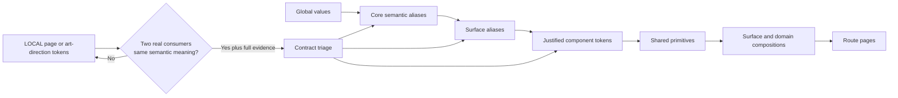

# Design Tokens: Niuva Frontend Experience and Design-System Blueprint

**Status:** Candidate — Context Only — Phase 4 owner-approved direction; not
canonical, not a runtime source, and not migration authority

**Date:** 18 August 2026

**Repository baseline:** `origin/main`
`8555685c29a3fde9976ae6499336e2eb45a330ba`

**Scope:** Review the durable NDS token values and roles, separate them from
surface and LOCAL expression, classify compatibility debt, expose token gaps,
and provide a visual specimen without changing `frontend/src/index.css`,
Tailwind, a component, or a route.

**Owner authorization:** The owner approved Phase 3 `IA-01` through `IA-12`,
approved Phase 4 `TOK-01` through `TOK-12`, and authorized preparation of the
Phase 5 task plan on 18 August 2026. That authorization covers only candidate
artifacts inside `.design/niuva-frontend-blueprint/`. It does not authorize
Phase 6, runtime token changes, consumer migration, dark mode, source
implementation, canonical promotion, or any delivery gate.

## 1. Review artifacts

- [`DESIGN_TOKENS.css`](DESIGN_TOKENS.css) is a non-runtime CSS-variable
  specimen containing exact candidate names and values.
- [`design-tokens-preview.html`](design-tokens-preview.html) visualizes the
  palette, typography, spacing, shape, feedback, and four surface registers.
- This document records status, rationale, compatibility, promotion, and
  review decisions that cannot be represented safely in CSS alone.

None of these files may be imported into the application. The only current
runtime source remains `frontend/src/index.css`; Tailwind remains a mapping
consumer.

## 2. Authority and conflict disposition

Use the repository reading order before this candidate. The most directly
applicable authority is:

1. [`DESIGN.md`](../../DESIGN.md), especially typography, color, token
   architecture, surface registers, motion, and compatibility;
2. [`DEC-UX-004`](../../docs/decisions/experience/DEC-UX-004-cross-surface-design-system-reconstruction.md);
3. the owner-approved candidate
   [semantic token and component-state contract](../../docs/implementation/specs/candidates/2026-08-17-niuva-semantic-token-component-state-contract-review.md);
4. the merged foundation evidence in the
   [component register](../../docs/implementation/plans/pending-reconciliation/2026-08-05-frontend-component-register.md);
5. the approved Phase 2 [`DESIGN_BRIEF.md`](DESIGN_BRIEF.md);
6. the approved Phase 3
   [`INFORMATION_ARCHITECTURE.md`](INFORMATION_ARCHITECTURE.md); and
7. current source and contract tests as implementation evidence.

Two generic `design-tokens` skill defaults are intentionally not followed:

- **Write to the runtime:** prohibited because this phase is a review artifact
  and application source needs a later exact-file task and owner gate.
- **Always generate dark mode:** conflicts with Niuva's explicit no-dark-mode
  foundation boundary. `darkMode: ["class"]` in Tailwind is configuration
  capability, not an activated Niuva theme contract.

The unresolved FDM conflict also remains visible. Canonical documents still
assign `motion-ambient` to FDM, while owner-approved candidate direction retires
the Homepage FDM visual. This phase preserves the current `15s` value as
compatibility evidence, creates no new consumer, and chooses no replacement.

## 3. Current-source snapshot

At the selected baseline, read-only inspection found:

- 293 unique custom-property definitions in `frontend/src/index.css`;
- 204 unique `var(--...)` names consumed under `frontend/src`;
- one CSS-variable runtime plus a Tailwind mapping layer;
- self-hosted Mona Sans Variable and Bona Nova Italic assets;
- compatibility delivery for Poppins, Inter, and JetBrains Mono;
- no Storybook, DTCG/JSON runtime, theme provider, or token package;
- no active Niuva dark-theme selector; and
- only the Homepage currently opting into `.nds-public-surface`; the Commerce,
  Account, and Operations NDS scope classes remain target evidence without
  route consumers.

These counts include indirection and compatibility definitions. They do not
prove that any alias is safe to remove.

### 3.1 Classification

<!-- markdownlint-disable MD013 -->

| Family | Current evidence | Phase 4 classification |
| --- | --- | --- |
| Niuva blue ramp, core surface/text/action/border/status roles | Defined, mapped, and contract-tested | Durable foundation; preserve values |
| Type ramp, spacing scale, radii, shadows, focus, and core motion | Defined and mapped | Durable foundation; preserve values and flat-first rules |
| `--public-*`, `--commerce-*`, `--account-*`, `--operations-*` | Defined; Public scope has one route consumer, other scope classes have none | Surface contract target; provisional until real surface adoption evidence exists |
| `--color-brand-*`, `--color-surface-page`, `--color-border-default/strong` | Active aliases | Compatibility; no new consumer, no removal without zero-consumer evidence |
| Operational HSL/shadcn family | Active compatibility mapping for current shared/operational UI | Compatibility; retain until consumer migration and rollback evidence |
| Poppins, Inter, hosted JetBrains Mono | Current compatibility consumers and delivery | Compatibility only; Mona/system roles remain the target |
| `--public-studio-*` | 28 root definitions used by the Homepage art-direction CSS | LOCAL Homepage evidence; not a durable Public surface palette |
| `--public-motion-*`, `--public-ease-*` | Homepage-only choreography consumers | LOCAL motion; not promoted by multiple uses inside one page |
| `--motion-ambient` | Current `15s` runtime value inside canonical `12–18s` envelope | Compatibility/conflict hold; no new consumer until FDM authority is reconciled |

<!-- markdownlint-enable MD013 -->

## 4. Token architecture



### 4.1 Dependency rules

- Route pages consume surface, component, or core semantic roles; never raw
  global values.
- Shared primitives consume core semantics and justified component tokens;
  they do not know Public, Commerce, Account, or Operations lifecycle enums.
- Surface aliases tune expression and density without changing permission,
  persistence, price, availability, or status authority.
- LOCAL variables stay with one page, prototype, or art direction.
- Two consumers are necessary but not sufficient for promotion. They must use
  the same semantic meaning and have an owner, NDS 13-field component record,
  accessibility and localization evidence, migration notes, and rollback.

### 4.2 Maturity labels

Every token family uses one of these labels:

- **Durable:** approved/current foundation value and semantic role.
- **Candidate:** proposed role or value awaiting owner review.
- **Provisional surface:** structurally approved but lacking implemented
  consumer evidence on that surface.
- **LOCAL:** page, prototype, or art-direction scope; no shared promise.
- **Compatibility:** retained for current consumers; no new consumer.
- **Conflict hold:** higher and candidate authority disagree; preserve current
  behavior and create no new consumer.
- **Retirement candidate:** removal proposed, but zero consumers and rollback
  evidence are not yet complete.

## 5. Color system

### 5.1 Niuva identity ramp

The identity ramp remains unchanged. Niuva blue is scarce identity/action/focus
support, not a default tint for every surface.

| Token | Value | Durable use |
| --- | --- | --- |
| `--nds-blue-50` | `#F1F6FA` | Quiet selected field |
| `--nds-blue-100` | `#E3EEF6` | Subtle identity or disabled surface |
| `--nds-blue-200` | `#C8DCEB` | Light identity line |
| `--nds-blue-300` | `#A6C3DA` | Inverse supporting detail |
| `--nds-blue-400` | `#7EA5C5` | Large graphic support |
| `--nds-blue-500` | `#6390BB` | Signature identity color |
| `--nds-blue-600` | `#4875A3` | Selected/active support |
| `--nds-blue-700` | `#315F8F` | Primary action and link |
| `--nds-blue-800` | `#244B73` | Hover action |
| `--nds-blue-900` | `#193753` | Pressed action/deep field |
| `--nds-blue-950` | `#0E1B27` | Primary ink and inverse surface |

### 5.2 Core semantic pairings

<!-- markdownlint-disable MD013 -->

| Role | Value or alias | Status | Rule |
| --- | --- | --- | --- |
| Canvas | `#F8FAFC` | Durable | Shared neutral page foundation; not a mandate that every Public section use one flat color |
| Default surface | `#FFFFFF` | Durable | Control/task/content surface where a boundary is meaningful |
| Elevated surface | alias to default | Candidate | Separate semantic role without inventing a new palette value |
| Muted surface | `#EDF4F8` | Durable | Secondary grouping, field, or quiet recovery |
| Selected surface | `#F1F6FA` | Durable | Selection presentation; never commercial or lifecycle commitment |
| Primary text | `#0E1B27` | Durable | Main readable text |
| Secondary text | `#44586B` | Durable | Supporting explanation |
| Muted text | `#566B7D` | Durable | Lower-emphasis text that still meets normal-text contrast |
| Disabled text | `#627486` | Durable | Disabled content with non-color explanation where expected |
| Control border | `#708BA3` | Durable | Meaningful control boundary at or above 3:1 |
| Decorative border | `#C8D7E4` | Durable | Non-essential separation only |
| Primary action | `#315F8F` | Durable | Main action on light surfaces |
| Hover/pressed action | `#244B73` / `#193753` | Durable | Pointer/pressed feedback without layout movement |
| Focus ring | `#315F8F` | Durable | Visible, non-color-only control focus treatment |
| Inverse surface/text | `#0E1B27` / `#FFFFFF` | Durable | Bounded evidence or overlay treatment, not global dark mode |

<!-- markdownlint-enable MD013 -->

### 5.3 Contrast evidence

The exact candidate pairs reproduce canonical measured contrast:

| Pair | Contrast | Disposition |
| --- | ---: | --- |
| Primary text / canvas | `16.66:1` | Normal and large text |
| Secondary text / canvas | `7.03:1` | Normal text |
| Muted text / canvas | `5.29:1` | Normal text |
| Disabled text / canvas | `4.60:1` | Text; disabled meaning also needs explicit context |
| Primary action / white | `6.64:1` | Button/link foreground relationship |
| Primary action / canvas | `6.34:1` | Link/text action |
| Signature blue / canvas | `3.22:1` | Large graphic/identity only; not normal body text |
| Control border / canvas | `3.40:1` | Meaningful control boundary |
| White / inverse surface | `17.43:1` | Inverse text |

### 5.4 Status palette

<!-- markdownlint-disable MD013 -->

| Presentation role | Foreground | Surface | Contrast | Domain rule |
| --- | --- | --- | ---: | --- |
| Information | `#214C78` | `#E8F2FA` | `7.81:1` | Explain information or non-terminal state |
| Success | `#23643A` | `#E8F5EC` | `6.33:1` | Render only after authoritative completion |
| Warning | `#6B4E00` | `#FFF3CC` | `6.98:1` | Explain risk, review, conflict, or required attention with text |
| Error | `#8F2430` | `#FBEAEC` | `7.34:1` | Distinguish validation from system/dependency failure |

<!-- markdownlint-enable MD013 -->

Conflict, uncertain, expired, offline, and permission are not given new shared
color tokens in this phase. Their distinct meaning comes from copy, icon,
heading, recovery action, and domain context. A later token alias requires at
least two real consumers with the same presentation need.

## 6. Typography system

### 6.1 Family roles

<!-- markdownlint-disable MD013 -->

| Role | Target family | Scope |
| --- | --- | --- |
| Display | Mona Sans Variable | Page and major section headings across surfaces |
| Body | Mona Sans Variable | Prose, forms, task explanation, and data context |
| UI | Mona Sans Variable | Navigation, control labels, tabs, filters, and table headings |
| Expression | Bona Nova Italic | At most one short Public-only interruption; never task UI |
| Technical | System monospace | Genuine hashes, IDs, revisions, measurements, or machine values |

<!-- markdownlint-enable MD013 -->

Poppins, Inter, and hosted JetBrains Mono remain compatibility-only and accept
no new consumer. This Phase 4 specimen demonstrates the target; it does not
authorize changing the current root or `.admin-workbench` bindings.

### 6.2 Type ramp

| Role | Size | Leading |
| --- | --- | --- |
| Home display | `clamp(2.25rem, 4.6vw, 3.5rem)` | `clamp(2.625rem, 5.1vw, 3.875rem)` |
| Page heading | `clamp(2.125rem, 4.2vw, 3rem)` | `clamp(2.5rem, 4.8vw, 3.4375rem)` |
| Section heading | `clamp(1.75rem, 3.4vw, 2.5rem)` | `clamp(2.1875rem, 4vw, 3rem)` |
| Subsection heading | `clamp(1.375rem, 2.4vw, 1.625rem)` | `clamp(1.8125rem, 3vw, 2.125rem)` |
| Card/region heading | `clamp(1.25rem, 2vw, 1.375rem)` | `clamp(1.75rem, 2.6vw, 1.875rem)` |
| Large body | `1.125rem` | `1.875rem` |
| Body | `1rem` | `1.625rem` |
| Small body | `0.875rem` | `1.375rem` |
| Label | `0.8125rem` | `1.125rem` |
| Technical | `0.75rem` | `1.125rem` |
| Button/navigation | `0.9375rem` | `1.25rem` |

The weight scale `400/500/600/700` and tracking roles `-0.02em/-0.01em/0`
are candidate conveniences in the specimen. They stay candidate until a later
consumer task proves fallback behavior and does not over-tighten letterforms.

## 7. Spacing and layout system

### 7.1 Global 4px rhythm

The durable global scale is:

```text
0, 4, 8, 12, 16, 20, 24, 32, 40, 48, 64, 80, 96, 120px
```

The specimen proposes semantic aliases for control padding, compact/default/
relaxed stacks, clusters, and page gutters. They are candidate aliases until
current consumers and migration cost are recorded.

### 7.2 Layout roles

| Role | Candidate value | Use |
| --- | --- | --- |
| Mobile gutter | `16px` | 320/390px foundation |
| Tablet gutter | `24px` | 768px foundation |
| Desktop gutter | `32px` | 1024/1440px foundation |
| Wide container | `84rem` | Wide evidence or Operations workspace |
| Content container | `70rem` | Standard content alignment |
| Narrow container | `48rem` | Focused Account/form/task composition |
| Prose measure | `65ch` | Default readable prose |
| Extended prose | `70ch` | Bounded Public editorial prose |
| Minimum control target | `44px` | General mobile interaction floor |

The alignment system remains 4 columns at mobile, 8 at intermediate widths,
and 12 at desktop. Breakpoints stay in build/layout configuration because CSS
custom properties cannot safely become media-query breakpoints. The review
matrix remains 320, 390, 768, 1024, and 1440px.

## 8. Shape, elevation, and focus

| Role | Value | Rule |
| --- | --- | --- |
| Small radius | `8px` | Compact bounded item |
| Control radius | `12px` | Input, button, select, and task control |
| Surface/card radius | `16px` | Meaningful contained region |
| Panel radius | `20px` | Larger task grouping |
| Feature radius | `24px` | Rare bounded feature surface |
| Full radius | `999px` | Status/filter/pill semantics only |
| Surface shadow | `0 1px 2px rgba(14,27,39,.06)` | Subtle layer separation, not every card |
| Navigation shadow | `0 8px 24px rgba(14,27,39,.09)` | Floating navigation/layer transition |
| Overlay shadow | `0 18px 48px rgba(14,27,39,.16)` | Dialog or real overlay only |
| Focus | `2px` ring, `3px` offset | Visible and unobscured |

The default remains flat-first. Public editorial regions may be edge-free;
Operations uses boundaries only when they improve scanning and ownership.

## 9. Motion tokens

| Token | Value | Durable use |
| --- | ---: | --- |
| `motion-instant` | `0ms` | Immediate semantic change |
| `motion-fast` | `120ms` | Hover, press, icon, color, opacity |
| `motion-standard` | `180ms` | Disclosure, form feedback, compact enter/exit |
| `motion-deliberate` | `280ms` | Bounded panel/modal/page-state change |
| `motion-ambient` | current `15s` | Conflict hold; no new consumer until FDM authority is resolved |

Core easing remains:

- `ease-standard: cubic-bezier(0.2, 0, 0, 1)`;
- `ease-enter: cubic-bezier(0, 0, 0.2, 1)`; and
- `ease-exit: cubic-bezier(0.3, 0, 1, 0.3)`.

React Bits, Magic UI, or another donor may inform a LOCAL motion study. It does
not create a shared token or runtime dependency. Repeated usages within one
Homepage remain one consumer context, not evidence for global promotion.

Reduced motion is defined by each component contract: remove spatial,
scroll-linked, scale, path, rotation, and pointer-dependent motion while
preserving static content and essential non-moving feedback. No global `1ms`
or `0.01ms` wipe is approved.

## 10. Surface token registers

The surfaces deliberately share most values. Their distinction comes from
composition, density, evidence, task hierarchy, and content—not four unrelated
palettes.

<!-- markdownlint-disable MD013 -->

| Surface | Candidate aliases | Expression rule | Current adoption status |
| --- | --- | --- | --- |
| Public | canvas, content surface, inverse evidence surface, expression color, extended prose measure | Editorial and evidence-led; Niuva blue selective; at most one Bona interruption | `.nds-public-surface` used by Homepage only; provisional outside that pilot |
| Commerce | canvas, summary surface, selected surface, specification border, prose measure | Product/specification hierarchy and authoritative transaction feedback | Alias and scope target; no active route consumer found |
| Account | canvas, task surface, recovery surface, prose measure | Calm focused identity, recovery, owned record, and next action | Alias and scope target; no active route consumer found |
| Operations | canvas, row surface, selected row, data border, 48px row density | Dense but calm queue/detail/editor workbench | Alias and scope target; no active route consumer found |

<!-- markdownlint-enable MD013 -->

Surface adoption occurs per exact route slice. A surface alias may not be used
to smuggle page-specific palette or motion into the durable foundation.

## 11. LOCAL art-direction boundary

The Phase 4 root specimen intentionally excludes:

- `--public-studio-*` color values;
- `--public-motion-focal`, `--public-motion-story`, and
  `--public-motion-media`;
- `--public-ease-arrive` and `--public-ease-shape`;
- a future Homepage signature visual;
- donor-component-specific values;
- a local Operations bento layout; and
- any single-page hero, gallery, carousel, accordion, chart, or illustration
  treatment.

Those values may live inside a page or prototype scope while being reviewed.
Promotion requires at least two independent real consumers with the same
semantic meaning—not several selectors in one file.

## 12. Component-token boundary

No new component token is promoted by this Phase 4 candidate. Current shared
primitives can express their reviewed states through core roles and existing
component APIs.

A future component token is justified only when:

1. the component is adopted or has a bounded provisional pilot;
2. at least two real consumers require the same semantic slot;
3. core and surface roles cannot express it without leaking implementation;
4. all NDS 13 fields are complete;
5. default, hover, focus, active, disabled, loading, error, and relevant domain
   states are covered;
6. responsive, localization, and accessibility evidence exists; and
7. migration, versioning, consumer inventory, and rollback are recorded.

`Button`, for example, should continue to use action, text, surface, border,
focus, radius, and motion roles instead of creating a token for every visual
variant.

## 13. Compatibility map

<!-- markdownlint-disable MD013 -->

| Current family | Target relationship | Phase 4 rule |
| --- | --- | --- |
| `--color-brand-primary/secondary` | identity signature/support | Compatibility only; no new consumer |
| `--color-surface-page` | surface canvas or surface alias | Compatibility only; migrate per surface |
| `--color-border-default/strong` | decorative/control boundary | Compatibility only; verify generated Tailwind consumers |
| HSL/shadcn roles | mapped core semantic roles | Retain until every Radix/shared/Operations consumer is migrated |
| Poppins/Inter/hosted JetBrains | Mona Sans/system technical target | Retain delivery until measured zero-consumer and layout evidence |
| `brand-page` scope | NDS surface scopes | Compatibility; do not globally switch descendants without route QA |
| `public-studio-*` | LOCAL Homepage art direction | No promotion; later retain locally, replace, or retire through its own slice |
| `public-motion-*` | LOCAL Homepage choreography | No promotion; donor studies remain local |
| `motion-ambient` | current FDM-bound motion role | Conflict hold; no new consumer and no removal until authority is reconciled |

<!-- markdownlint-enable MD013 -->

Removal requires a named replacement, current `origin/main` zero-consumer
evidence including generated utilities, focused and aggregate checks,
changelog, rollback, and separate approval.

## 14. Dark-mode disposition

Dark mode is intentionally absent from `DESIGN_TOKENS.css`.

- A bounded inverse evidence field is not a theme.
- Tailwind's `darkMode: ["class"]` setting is inert capability, not product
  approval or proof of complete dark values.
- A future dark theme would require user need, all four surface registers,
  media and manual preference behavior, persistence/privacy, color and status
  contrast, chart/media treatment, screenshots, and migration evidence.
- Until then, do not add `[data-theme="dark"]`, `.dark`, automatic system-theme
  switching, or dark-only component variants.

## 15. Candidate Phase 4 decisions

<!-- markdownlint-disable MD013 -->

| ID | Candidate Design Tokens decision | Status |
| --- | --- | --- |
| `TOK-01` | Keep `frontend/src/index.css` as the single runtime source; Phase 4 artifacts remain non-runtime review evidence. | Owner-approved candidate |
| `TOK-02` | Preserve the current Niuva blue ramp, core semantic pairings, status palette, and measured contrast as the durable foundation. | Owner-approved candidate |
| `TOK-03` | Keep Mona Sans as the shared target, Bona Nova as one bounded Public expression role, and system monospace for genuine technical values; compatibility fonts gain no new consumers. | Owner-approved candidate |
| `TOK-04` | Preserve the 4px rhythm, 4/8/12-column alignment, semantic containers, 65–70ch measures, and 44px mobile target without turning the grid into one page template. | Owner-approved candidate |
| `TOK-05` | Keep radii bounded and elevation flat-first; shadow is reserved for navigation, overlays, or real depth transitions. | Owner-approved candidate |
| `TOK-06` | Preserve 0/120/180/280ms core motion; hold `motion-ambient` without new consumers until FDM authority is reconciled; keep expressive choreography LOCAL. | Owner-approved candidate |
| `TOK-07` | Let the four surfaces share the durable palette while differentiating through surface aliases, composition, density, evidence, and task hierarchy. | Owner-approved candidate |
| `TOK-08` | Treat surface aliases as provisional until exact route consumers and browser evidence exist; their presence in root is not adoption proof. | Owner-approved candidate |
| `TOK-09` | Promote no new component tokens in Phase 4; require two real consumers, the NDS 13 fields, accessibility, localization, migration, and rollback first. | Owner-approved candidate |
| `TOK-10` | Keep page/art-direction and donor values in LOCAL scope; multiple selectors within one page count as one consumer context. | Owner-approved candidate |
| `TOK-11` | Do not activate or generate dark mode; inverse surfaces remain bounded semantic roles. | Owner-approved candidate |
| `TOK-12` | Preserve compatibility families without new consumers until exact zero-consumer and removal gates pass. | Owner-approved candidate |

<!-- markdownlint-enable MD013 -->

## 16. Phase 4 acceptance criteria

The owner accepted this Phase 4 direction on 18 August 2026 after confirming
that:

- exact durable values match current canonical/current foundation evidence;
- global, core semantic, surface, component, LOCAL, compatibility, conflict,
  and retirement statuses are distinguishable;
- no lifecycle or provider authority is encoded in token names;
- surface differentiation does not create four disconnected palettes;
- color pairs meet the recorded contrast floors for their intended use;
- typography preserves target and compatibility boundaries;
- spacing, grid, measure, control target, radius, elevation, focus, motion, and
  reduced behavior are represented;
- current Homepage art-direction and motion values are not silently promoted;
- dark mode remains explicitly unapproved;
- the CSS specimen is not imported by the application;
- the visual specimen uses no runtime dependency or fabricated product data;
  and
- no source, migration, delivery, readiness, or go-live authority is implied.

## 17. Phase 5 handoff

With `TOK-01` through `TOK-12` approved, the owner authorized Phase 5 Brief to
Tasks on 18 August 2026. Phase 5 may turn the approved brief, IA, and token
boundaries into an ordered task list that separates:

1. cross-surface component specifications;
2. wireframe families and required state variants;
3. Public visual exploration;
4. Commerce and Account task-flow exploration;
5. Operations queue/detail/editor exploration;
6. LOCAL motion/donor studies;
7. responsive, accessibility, localization, and browser validation; and
8. later exact-file migration slices.

Phase 5 remains candidate planning evidence. Its task list does not authorize
Phase 6, application implementation, or any delivery gate.

## 18. Explicit exclusions

This Phase 4 candidate does not authorize or perform:

- changes to `frontend/src/index.css`, Tailwind, fonts, components, routes,
  tests, build configuration, dependencies, or application consumers;
- a new palette, page art direction, Homepage signature visual, dark mode,
  donor dependency, theme engine, Storybook, or DTCG/JSON runtime;
- compatibility removal, global typography cutover, or surface migration;
- route, locale, redirect, CMS, API, schema, authorization, provider, upload,
  payment, storage, or business-rule changes;
- canonical promotion or replacement of `DESIGN.md`; or
- stage, commit, push, PR, merge, deployment, readiness, or go-live work.

## Self-review

- [x] Global/core/surface roles remain purpose-based and separate from LOCAL
  page/art-direction values.
- [x] The two-real-consumer rule and compatibility boundary remain explicit.
- [x] This proposal does not replace runtime tokens or authorize migration.

**Self-review result:** Pass; token proposal remains candidate-only.
