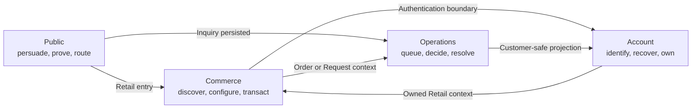
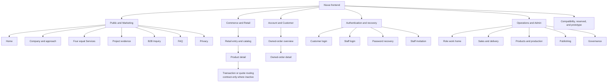
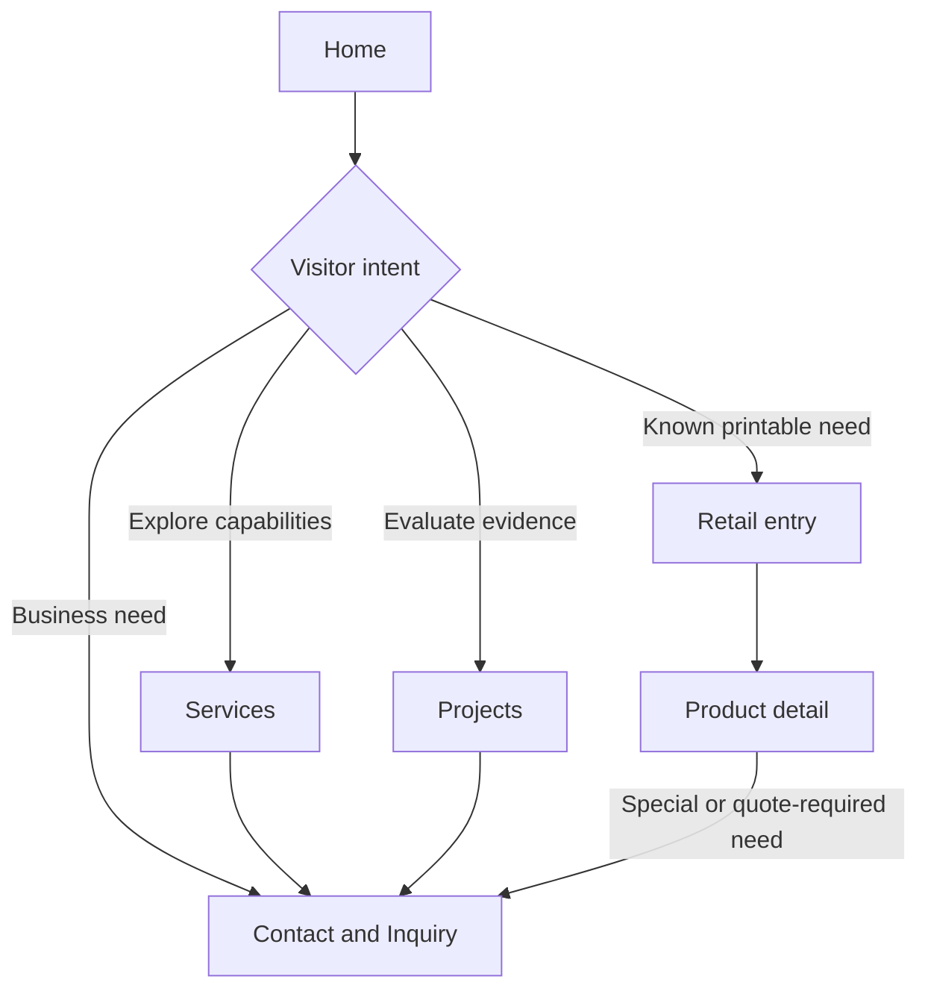
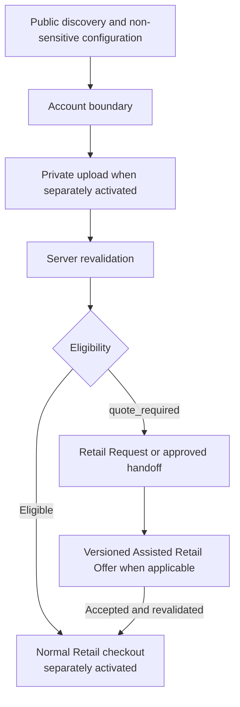
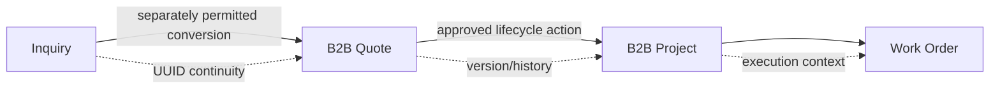

# Information Architecture: Niuva Frontend Experience and Design-System Blueprint

**Status:** Candidate — Context Only — Phase 3 owner-approved direction; not
canonical, not route activation, and not implementation authority

**Date:** 18 August 2026

**Repository baseline:** `origin/main`
`8555685c29a3fde9976ae6499336e2eb45a330ba`

**Scope:** The complete frontend information architecture across Public,
Commerce, Account, authentication, and Operations, including active routes,
compatibility aliases, reserved paths, prototypes, navigation ownership, page
responsibilities, cross-route continuity, material user flows, visible state
ownership, component reuse boundaries, and content growth.

**Owner decision:** The owner approved `IA-01` through `IA-12` as Phase 3
Information Architecture direction on 18 August 2026, approved Phase 4
`TOK-01` through `TOK-12`, and separately authorized preparation of the Phase 5
task plan. Those approvals do not authorize Phase 6, route or capability
activation, application source changes, canonical promotion, or any delivery
gate.

## 1. Authority, evidence, and notation

Read this document after:

1. [`NIUVA_MASTER_SPEC.md`](../../docs/NIUVA_MASTER_SPEC.md)
2. [`DOCUMENT_REGISTER.md`](../../docs/context/DOCUMENT_REGISTER.md)
3. [`DECISION_REGISTER.md`](../../docs/decisions/DECISION_REGISTER.md)
4. The approved decision or ADR applicable to the task
5. [`DESIGN.md`](../../DESIGN.md) within its approved scope
6. The applicable runbook
7. Current source and tests as implementation evidence
8. The Phase 2 [`DESIGN_BRIEF.md`](DESIGN_BRIEF.md)
9. This Phase 3 candidate

The most directly applicable approved decisions are
[`DEC-UX-003`](../../docs/decisions/experience/DEC-UX-003-mvp-user-flow-and-route-contract.md)
for Public route and locale ownership and
[`DEC-UX-004`](../../docs/decisions/experience/DEC-UX-004-cross-surface-design-system-reconstruction.md)
for cross-surface experience and component boundaries. Retail and account
flows additionally remain governed by their applicable product decisions.

This document uses the following labels:

<!-- markdownlint-disable MD013 -->

| Label | Meaning |
| --- | --- |
| **Current** | The route or behavior exists in source at the selected baseline. It is implementation evidence, not readiness or provider evidence. |
| **Canonical pair** | Public ID/EN route ownership is approved, even when current translated content may fall back safely. |
| **Compatibility** | Retained for an existing inbound link or legacy workflow. It is not a preferred new destination or independent owner. |
| **Reserved** | The path or capability has an approved reservation or boundary but is not active. |
| **Prototype** | Environment-gated exploration; never production or adoption evidence by itself. |
| **Contract-only** | The product/lifecycle direction is approved, but no active route, provider, or implementation is assigned here. |
| **Candidate IA** | A Phase 3 structural recommendation requiring owner review and later exact-file planning before implementation. |

<!-- markdownlint-enable MD013 -->

If source and canonical authority disagree, this document records the conflict;
it does not silently promote source behavior or rewrite authority.

## 2. Structural decisions

### 2.1 One platform, four surface-native spaces

Niuva is one website and operational platform with four distinct experience
spaces:



Shared primitives own interaction mechanics, baseline state perception, and
accessibility. Surface and domain compositions own task hierarchy, density,
copy, privacy, lifecycle meaning, and recovery. A shared component never makes
a backend transition authoritative.

### 2.2 Navigation depth

The candidate depth budget is intentionally shallow at global level and deeper
only where the task genuinely requires it:

<!-- markdownlint-disable MD013 -->

| Surface | Candidate depth | Reason |
| --- | ---: | --- |
| Public | One global level plus contextual page links | Visitors need positioning and route choice, not a taxonomy browser. |
| Commerce | Entry → collection/product → separately gated transaction step | Product context may deepen, but inactive checkout routes must not be invented. |
| Account | Workspace home → owned record detail | Customer tasks should remain direct and private. |
| Operations | Role home/group → queue → record/detail/editor | Operational depth follows ownership and lifecycle, with breadcrumb and return context. |

<!-- markdownlint-enable MD013 -->

This budget does not authorize a new route. It is a test for later proposals:
additional depth requires a real task, owner, state model, and return path.

### 2.3 Frequency evidence and the 80 percent view

No production analytics dataset was reviewed for this phase. Therefore this
document does not claim which screen receives 80 percent of traffic or staff
time. Until measured evidence exists, prioritization uses task criticality as a
hypothesis:

- Public: entry and route choice, then Services, Projects, and Contact;
- Commerce: Retail discovery, filtering, and product evaluation;
- Account: owned-order overview and detail;
- Operations: role home, owned queue, and record detail.

Later analytics may change ordering or emphasis, but must not override
lifecycle, authorization, privacy, or equal-Service authority.

## 3. Site map

### 3.1 Platform map



### 3.2 Public and Marketing routes

Indonesian is primary. Activated English counterparts use the same content
responsibility; translation fallback behavior remains governed by
`DEC-UX-003`.

<!-- markdownlint-disable MD013 -->

| Responsibility | Indonesian | English | Status | Page owner |
| --- | --- | --- | --- | --- |
| Homepage | `/` | `/en` | Current canonical pair | Public |
| Company and approach | `/tentang` | `/en/about` | Current canonical pair | Public |
| Service overview | `/layanan` | `/en/services` | Current canonical pair | Public |
| Project archive | `/proyek` | `/en/projects` | Current canonical pair | Public evidence |
| B2B inquiry and contact | `/kontak` | `/en/contact` | Current canonical pair | Public entry; Inquiry lifecycle after persistence |
| FAQ | `/faq` | `/en/faq` | Current canonical pair | Public support content |
| Privacy | `/privasi` | `/en/privacy` | Current canonical pair | Public policy content |
| Retail entry | `/retail` | `/en/retail` | Current canonical pair | Public-to-Commerce boundary |

<!-- markdownlint-enable MD013 -->

The four primary Services remain equal in information rank, visual rank, and
default detail action. The IA must not reintroduce a primary/supporting split
or a `Capabilities` hierarchy.

### 3.3 Commerce and Retail routes

<!-- markdownlint-disable MD013 -->

| Route or flow | Status | Responsibility | Boundary |
| --- | --- | --- | --- |
| `/retail`, `/en/retail` | Current canonical pair | Public Retail entry, category/product discovery, filters, pagination, and truthful availability | No guest checkout or provider promise |
| `/retail/products/:slug` | Current | Product evidence, variants, publication state, and next eligible action | Retained unprefixed route uses stored interface language |
| Configuration before sensitive data | Contract-only | Non-sensitive candidate configuration | Local state is not authoritative price, stock, ETA, or eligibility |
| Private artwork upload | Reserved/inactive until its gate | Customer-owned file context | Requires authentication, private storage, and separate provider authority |
| Cart and checkout | Reserved/inactive until its gate | Server-revalidated transaction path | No URL is assigned by this IA |
| `quote_required` handoff | Contract-only | Preserve product, variant, configuration, quantity, file version, contact, fulfillment, and reason context | Creates no Order, reservation, payment attempt, paid state, or checkout total |

<!-- markdownlint-enable MD013 -->

Current source presents Retail discovery and product evaluation. This IA maps
the approved target transaction boundary without claiming that checkout,
payment, upload, or fulfillment is active.

### 3.4 Account and Customer routes

<!-- markdownlint-disable MD013 -->

| Route | Status | Responsibility |
| --- | --- | --- |
| `/dashboard` | Current protected route | Customer workspace and owned legacy-order overview |
| `/orders/:id` | Current protected route | Customer-safe detail for one owned order, including allowed file, payment, and history projection |
| `/order` | Current compatibility destination | Explain that the old create-order entry is inactive and route users toward Retail or their dashboard |

<!-- markdownlint-enable MD013 -->

Future Request, Offer, checkout, Order, payment, and production-tracking pages
must receive their own task card and route ownership. This document does not
collapse them into `/dashboard` or assign new paths.

### 3.5 Authentication, invitation, and recovery routes

<!-- markdownlint-disable MD013 -->

| Route | Audience | Status | Responsibility |
| --- | --- | --- | --- |
| `/login` | Customer | Current | Customer authentication and safe return to an owned destination |
| `/admin/login` | Staff | Current | Staff authentication and role-aware Operations entry |
| `/staff-invitation` | Invited staff | Current | Validate and accept a bounded invitation |
| `/forgot-password` | Customer or staff recovery | Current | Request password recovery without disclosing account existence |
| `/forgot-password/check-email` | Recovery | Current | Explain the next safe step after a request |
| `/reset-password` | Recovery token holder | Current | Validate token and set a policy-compliant password |
| `/reset-password/success` | Recovery | Current | Confirm the completed reset and provide the correct login destination |
| `/reset-password/error` | Recovery | Current | Explain invalid or expired recovery authority and restart safely |

<!-- markdownlint-enable MD013 -->

`/register` and external identity providers remain inactive. Customer and
staff forms may reuse primitives but do not share audience, return destination,
permission, invitation, or recovery meaning.

### 3.6 Operations and Admin routes

The sidebar is a role-filtered work map. Backend handlers and data queries
remain the authorization boundary.

<!-- markdownlint-disable MD013 -->

| Navigation group | Current routes | Primary responsibility |
| --- | --- | --- |
| Work Home | `/admin` | Role-aware work entry, queue orientation, and owned next action |
| Sales and Delivery | `/admin/inquiries`, `/admin/inquiries/:id`, `/admin/b2b/quotes`, `/admin/b2b/quotes/:id`, `/admin/b2b/quotes/:id/revision`, `/admin/b2b/projects`, `/admin/b2b/projects/:id`, `/admin/retail-orders`, `/admin/retail-orders/:id` | Inquiry triage, quote revision, B2B Project continuity, and Retail Order processing |
| Sales compatibility | `/admin/orders`, `/admin/contacts` | Existing compatibility workflows; not preferred new information owners |
| Products and Production | `/admin/catalog`, `/admin/catalog/:productId`, `/admin/materials`, `/admin/inventory`, `/admin/stock-movements`, `/admin/b2b/work-orders`, `/admin/b2b/work-orders/:id` | Catalog, material, stock, movement history, and work execution |
| Contextual production utility | `/admin/restock-alerts` | Restock exception context; current route is not a primary sidebar destination |
| Publishing | `/admin/portfolio`, `/admin/portfolio/:id`, `/admin/content` | Portfolio and public-content lifecycle, versions, and publication |
| Governance | `/admin/users`, `/admin/customers`, `/admin/settings`, `/admin/communication` | Identity, customer projection, settings, and communication governance |
| Operations utility | `/admin/notifications` | Notification center reached from the notification utility, not a new sidebar group |

<!-- markdownlint-enable MD013 -->

`/admin/catalog/:productId` also represents the current new/edit catalog
pattern when `productId` is `new`. `/admin/content` currently multiplexes list
and editor state inside one route. This IA records those facts without deciding
that they are the final URL model.

### 3.7 Compatibility aliases

The following paths are inbound compatibility only:

| Superseded path | Canonical destination |
| --- | --- |
| `/about` | `/tentang` |
| `/capabilities` | `/layanan` |
| `/services` | `/layanan` |
| `/projects` | `/proyek` |
| `/portfolio` | `/proyek` |
| `/contact` | `/kontak` |
| `/privacy` | `/privasi` |
| `/en/capabilities` | `/en/services` |

Current application redirects preserve safe query and hash context. A one-hop
HTTP `308` at the delivery boundary remains a separate infrastructure gate;
client navigation alone does not prove that contract.

### 3.8 Reserved, prototype, and catch-all paths

<!-- markdownlint-disable MD013 -->

| Path | Classification | Rule |
| --- | --- | --- |
| `/proyek/:slug` | Reserved | Do not create links, sitemap entries, canonical tags, analytics identities, or CMS ownership until activation is approved. |
| `/en/projects/:slug` | Reserved | Same boundary as the Indonesian project-detail prefix. |
| `/__brand-lab/editorial` | Prototype | Environment-gated exploration; not navigation, adoption, or production evidence. |
| `/__brand-lab/experimental` | Prototype | Environment-gated exploration; not navigation, adoption, or production evidence. |
| `*` | Current catch-all | Locale-aware Not Found recovery with links to owned Public destinations. |

<!-- markdownlint-enable MD013 -->

## 4. Navigation model

### 4.1 Public global navigation

The current-source model and Phase 3 candidate baseline are:

- Home through the official Niuva mark and visible name;
- direct destinations for Services, Projects, About, Contact, and Retail;
- exact ID/EN counterpart selection as a utility;
- customer login as an account utility;
- one B2B discussion action that resolves to Contact; and
- FAQ and Privacy in support/footer navigation.

The candidate rule is a direct, shallow model with no mega menu and no mobile
accordion taxonomy. Mobile exposes the same destination set in a modal menu,
with deterministic focus return and no hover-only destination. Exact visual
order, capsule treatment, and drawer composition remain a later design task.

### 4.2 Commerce navigation

Commerce uses task context rather than a second marketing sitemap:

1. Retail entry exposes categories, filters, products, and truthful states.
2. Product detail preserves a clear return to the Retail result context.
3. A next action communicates whether the item is unavailable,
   discovery-only, `quote_required`, or eligible for a separately activated
   transaction.
4. Authentication, when required, preserves the allowed destination and safe
   context.
5. A future multi-step transaction may use a local step indicator, but it must
   not become global navigation or imply backend commitment.

### 4.3 Account navigation

Account navigation is an owned-resource workspace:

- Dashboard is the stable workspace entry.
- Order rows/cards link only to an owned detail.
- Retail remains the route for product discovery.
- Logout and identity controls are utilities, not content destinations.
- A missing, forbidden, expired, or stale resource returns to the nearest
  owned workspace without exposing protected detail.

### 4.4 Authentication navigation

Authentication shells provide only the paths needed to complete or recover the
current identity task. Customer and staff login must remain visually related
but unmistakably labelled. Return URLs preserve `pathname`, `search`, and
`hash` only when safe. Recovery and invitation tokens never become persistent
navigation items.

### 4.5 Operations navigation

Operations uses three coordinated navigation layers:

1. a permission-filtered sidebar for stable work groups;
2. a role-aware work home for the highest-priority owned queue; and
3. breadcrumbs plus record-local actions for queue → detail → editor/revision
   continuity.

Notifications are a utility. Restock alerts and record revisions are contextual
destinations. Hidden navigation is not authorization; direct URL access still
requires backend and query enforcement.

### 4.6 Cross-surface transitions

<!-- markdownlint-disable MD013 -->

| From | To | Context that may cross | Context that must not be fabricated |
| --- | --- | --- | --- |
| Public → Contact | Inquiry entry | Locale, chosen need, safe campaign/source context | Inquiry UUID before persistence |
| Public → Retail | Commerce discovery | Locale preference and public source context | Account, price, stock, reservation, or checkout state |
| Retail → Login → Retail | Account boundary | Safe return URL and non-sensitive draft context | Authoritative configuration, price, file, or eligibility |
| Retail → Contact/Request | `quote_required` or special need | Product, variant, quantity, safe analysis, contact, fulfillment, and reason context when approved | Order, payment, reservation, paid state, or checkout total |
| Account → Retail | Continue shopping | Stored language and customer session | Admin permission or public campaign state |
| Public Inquiry → Operations | Persisted record | Existing Inquiry UUID and permitted fields | Quote, Project, price, ETA, or delivery success |
| Operations → Account | Customer-safe projection | Owned resource state allowed by policy | Internal cost, margin, supplier, profit, or internal notes |

<!-- markdownlint-enable MD013 -->

## 5. Content hierarchy and page responsibilities

### 5.1 Public page hierarchy

<!-- markdownlint-disable MD013 -->

| Page | Primary question | Required hierarchy | Must not become |
| --- | --- | --- | --- |
| Home | “Is Niuva relevant, credible, and where do I start?” | Positioning → two journey choices → one five-stage process → factual project evidence → four equal Services → Retail path → Contact summary → FAQ support → closing action | A generic agency template, duplicate process rails, or checkout page |
| About | “Who is Niuva and how does it approach work?” | Identity and partner role → factual dossier/evidence → approach → values/ecosystem → next action | Invented history, awards, capacity, or team claims |
| Services | “Which of the four equal Services fits my need?” | Equal overview and detail action for Research & Development, Consultant & Workshop, Design & Prototyping, and Apparel & Merchandise → recovery states → Contact handoff | A primary/supporting hierarchy or repeated card template by default |
| Projects | “What has Niuva actually done and what does it prove?” | Published evidence → context/challenge → method or contribution → output → capability proven → archive recovery/contact path | Unverified project details, fabricated outcomes, or active detail links |
| Contact | “What should I submit and what happens next?” | Expectation → structured form → validation/persistence state → Inquiry UUID success → optional WhatsApp → response-target explanation | Public upload, auto-WhatsApp, quote creation, or false success |
| FAQ | “Can I resolve a common question safely?” | Searchable/scannable topic groups → answer → related owned destination → empty/error recovery | A replacement for policy, account support, or lifecycle state |
| Privacy | “How is my submitted data used?” | Policy scope → data purpose → retention/contact route → current revision | Consent-by-obscurity or marketing consent bundled into inquiry consent |

<!-- markdownlint-enable MD013 -->

Homepage composition remains visually adjustable. The hierarchy above is an
information and truth contract, not approval of a specific art direction,
card grid, FDM replacement, or animation.

### 5.2 Commerce page hierarchy

**Retail entry/catalog**

1. Retail purpose and current capability boundary.
2. Category and filter controls with visible current selection.
3. Product results with publication, price/quote, and availability meaning.
4. Loading, unavailable, system error, empty result, and load-more recovery.
5. A special-needs path to Contact without misclassifying every large request
   as B2B.

**Product detail**

1. Back/return context.
2. Product identity, approved visual evidence, and category.
3. Description and factual configuration/variant information.
4. Publication, availability, and price or quote status.
5. One truthful next action: unavailable, discovery-only, `quote_required`, or
   eligible for a separately activated transaction.
6. Loading, not-found, unavailable, and dependency-recovery states.

No current page may imply active payment, fulfillment, private upload, or
production tracking merely because the future flow is represented here.

### 5.3 Account and authentication hierarchy

<!-- markdownlint-disable MD013 -->

| Archetype | Required hierarchy |
| --- | --- |
| Customer dashboard | Identity/workspace heading → owned summary → owned record list/cards → empty/error/retry → Retail route |
| Owned-order detail | Safe reference and status → factual commercial summary → allowed file/payment/history projection → recovery and return |
| Customer login | Audience label → credentials → validation/dependency state → recovery route → safe return |
| Staff login | Staff audience and operational destination → credentials → validation/dependency state → recovery route |
| Password recovery | Request → non-enumerating acknowledgement → token validation → new-password policy → success or bounded restart |
| Staff invitation | Invitation identity and expiry → acceptance form → permission-safe success or expiry recovery |
| Not Found | Clear missing-route state → locale-aware Home, Services, Projects, and Contact recovery links |

<!-- markdownlint-enable MD013 -->

### 5.4 Operations archetypes

Operations pages reuse task archetypes without flattening domain semantics:

<!-- markdownlint-disable MD013 -->

| Archetype | Hierarchy | Typical consumers |
| --- | --- | --- |
| Role work home | Role context → urgent/owned work → age or exception → next valid action | `/admin` |
| Queue/list | Scope and filters → count/cursor state → rows/cards → bulk or row action when authorized → empty/error/retry | Inquiries, quotes, projects, work orders, Retail Orders, catalog, inventory, users, customers |
| Record detail | Reference and lifecycle status → customer-safe or internal context by role → action boundary → history → conflict/recovery | Inquiry, quote, Project, work order, Retail Order, portfolio detail |
| Revision/editor | Record/version identity → editable fields → validation → preview/diff where relevant → guarded save/publish/submit → conflict recovery | Quote revision, catalog new/edit, content editor, portfolio editor |
| Inventory movement | Subject/material context → quantity and reason → reference → authoritative result/history | Inventory and stock movements |
| Publishing lifecycle | Draft/published context → factual content and asset provenance → locale readiness → version/history → publish or rollback gate | Content and portfolio |
| Governance | Identity or setting scope → permissions/current value → guarded mutation → audit-safe result | Users, customers, settings, communication |

<!-- markdownlint-enable MD013 -->

An Operations bento grid, if later explored, is local to a proven work-home
hierarchy. It does not replace queues, tables, forms, details, lifecycle
recovery, or factual metrics.

## 6. Material user flows

### 6.1 Public discovery and journey choice



Every branch provides a return or next owned destination. Projects do not link
to reserved detail routes. Retail remains discoverable but secondary to the
Homepage B2B narrative.

### 6.2 Public B2B Inquiry

```text
/kontak#form-konsultasi or /en/contact#form-konsultasi
  -> enter the required structured fields and exact privacy consent
  -> client validation preserves safe entered values
  -> persistence attempt disables duplicate submission
  -> success only after Inquiry is persisted as `new`
  -> visible acknowledgement contains the existing Inquiry UUID
  -> optional user-clicked WhatsApp continuation
  -> manual Operations triage and follow-up
```

Alternate and recovery paths:

- validation error focuses an actionable summary or field and retains values;
- dependency/offline failure states whether anything persisted and offers only
  a safe retry;
- uncertain persistence reconciles authoritative state before another submit;
- WhatsApp failure does not change or disprove the persisted Inquiry; and
- no public raw-file upload, automatic WhatsApp, Quote/Project creation, price,
  ETA, or delivery guarantee is introduced.

### 6.3 Locale continuity

```text
Current Public page
  -> user explicitly selects ID or EN
  -> exact counterpart when complete
  -> otherwise approved Indonesian fallback with visible notice and SEO rules
```

On retained unprefixed Commerce, Account, Login, and Operations routes, a
language change preserves the current canonical URL and owned-resource context
while updating the stored interface preference. It never invents an `/en`
private route or returns a user to the Retail entry.

### 6.4 Retail discovery and transaction boundary

Current source flow:

```text
Retail entry
  -> filter or browse published products
  -> product detail
  -> unavailable, discovery-only, or quote-required next action
  -> Contact when a special need requires human review
```

Approved target contract, still without assigned transaction URLs:



The target map is not current capability evidence. `quote_required` preserves
context without creating an Order, reservation, payment attempt, paid state,
or checkout total. B2B Inquiry/Quote/Project and Retail
Request/Offer/Order remain separate lifecycles.

### 6.5 Authentication and safe return

```text
Protected customer destination
  -> unauthenticated boundary
  -> /login with safe pathname + search + hash return context
  -> customer authentication
  -> authorization and resource ownership check
  -> intended owned destination OR bounded recovery
```

Staff uses `/admin/login` and a role-aware Operations destination. An Admin
session does not silently become a customer session. Forbidden and missing
resource states avoid protected-detail disclosure.

### 6.6 Password recovery and staff invitation

```text
Request or invitation entry
  -> non-enumerating/permission-safe validation
  -> email or token boundary
  -> expiry and integrity check
  -> password or invitation acceptance
  -> visible success with correct audience destination
```

Expired, invalid, used, or dependency-failed authority provides a specific safe
restart. Query tokens are sensitive transient inputs, not navigation state,
analytics labels, or persistent page content.

### 6.7 Customer owned-order flow

```text
/dashboard
  -> loading, error, empty, or owned-order list
  -> /orders/:id
  -> customer-safe order, file, payment, and history projection
  -> return to dashboard or Retail
```

`/order` is a compatibility explanation, not an active create-order flow.
Future Retail Requests, Offers, and Orders require explicit route and data
ownership instead of being hidden inside the legacy order view.

### 6.8 Operations entry and queue processing

```text
/admin/login
  -> role and permission bootstrap
  -> /admin role work home
  -> authorized queue
  -> record detail
  -> permitted transition, revision, or recovery
  -> updated queue/history
```

The UI filters navigation and actions for comprehension. Backend authorization,
least-privilege queries, conflict handling, and customer-safe projection remain
mandatory. An unauthorized deep link produces a permission-safe state rather
than relying on a hidden menu item.

### 6.9 B2B Operations continuity



Each resource retains its own reference, lifecycle, permissions, history, and
recovery. The dotted context links do not merge resources or imply an automatic
transition.

### 6.10 Retail Operations continuity

```text
Authorized Retail Order queue
  -> Retail Order detail
  -> customer-safe commercial context plus role-permitted internal context
  -> permitted fulfillment/production action
  -> conflict-safe history and customer projection
```

Retail Request, Assisted Retail Offer, Retail Order, payment, inventory, and
production remain distinct. Uncertain irreversible actions reconcile the
authoritative state before retry.

### 6.11 Catalog, content, and evidence publishing

```text
Authorized list
  -> create or edit a draft/version
  -> validate factual content, asset provenance, locale readiness, and state
  -> preview or compare where applicable
  -> guarded publish/rollback action
  -> public projection only after authoritative success
```

Public content, portfolio evidence, and catalog data can grow independently.
Publishing success is not represented before the backend confirms it, and
historical versions remain traceable.

## 7. Shared state and recovery ownership

<!-- markdownlint-disable MD013 -->

| Context | Shared presentation responsibility | Domain-owned meaning and recovery |
| --- | --- | --- |
| Route bootstrap | Skeleton or stable loading region, status announcement | Which session/content dependencies are pending |
| Empty content | Explain absence and expose a valid action | Whether content is unpublished, filtered out, not owned, or truly absent |
| Form validation | Summary, field relationship, focus management, value preservation | Field rules, consent, and permissible correction |
| Dependency failure | Visible in-page error, safe retry affordance, retained allowed context | Whether anything persisted and whether retry may duplicate effects |
| Permission | Clear unavailable state without leaking protected detail | Role, resource ownership, escalation, and return destination |
| Conflict/stale | Compare/reload/reconfirm affordance and preserved work | Authoritative version, commercial revalidation, and allowed mutation |
| Expired | Named expired authority and restart action | Session, invitation, token, Offer, quote, or reservation semantics |
| Offline/uncertain | Persisted/not-persisted distinction and safe pause | Reconciliation before irreversible retry |
| Success | Visible completed action, reference, ownership, and next step | Authoritative UUID/Order/payment/publication/lifecycle result |

<!-- markdownlint-enable MD013 -->

A toast or live region may reinforce these states but cannot be the only
representation of critical failure, conflict, uncertainty, or success.

## 8. Naming conventions

### 8.1 Routes and URLs

- Public Indonesian routes use approved Indonesian responsibility names.
- Public English routes use `/en` plus the approved English responsibility.
- Retained private Commerce, Account, Login, and Operations routes remain
  unprefixed and use stored language preference.
- Collection routes use nouns; dynamic records use stable `:id` or `:slug`
  parameters already owned by the route contract.
- Compatibility aliases never become page titles, navigation labels, or
  independent content owners.
- Reserved paths remain absent from active navigation, sitemap, canonical, and
  analytics ownership.
- Sensitive tokens may appear only in their bounded transient flow and must be
  redacted from telemetry and support output.

### 8.2 Labels and lifecycle language

- Public labels describe visitor intent: Services, Projects, About, Contact,
  Retail, FAQ, and Privacy.
- Operations labels describe owned work and domain resources, not generic
  “manage” destinations.
- View terms such as `loading`, `submitting`, `validating`, `selected`, and
  `quote_required` are not silently promoted to backend lifecycle enums.
- Inquiry, Retail Request, Assisted Retail Offer, Retail Order, B2B Quote,
  Project, Work Order, payment, and inventory keep distinct names.
- Success copy names exactly what completed and includes an authoritative
  reference where one exists.

### 8.3 Components and compositions

- Shared primitives use role names such as `Button`, `Input`, `Dialog`,
  `Table`, and `Alert`.
- Repeated cross-surface patterns use purpose names only after real consumer
  evidence, for example `ErrorSummary` or `PaginationControls`.
- Surface compositions include their owner, for example `PublicProjectEvidence`,
  `RetailProductSummary`, `AccountOrderHistory`, or `OperationsQueueToolbar`.
- Domain compositions include the resource when state meaning differs, for
  example `InquiryStatus` or `RetailOrderStatus` rather than `UniversalStatus`.
- Page-local art direction remains local and does not gain a shared-system name
  merely because it is visually reusable.

## 9. Component reuse map

The following map identifies specification targets for later phases. It does
not promote a component by listing it.

<!-- markdownlint-disable MD013 -->

| IA need | Shared primitive or mechanic | Surface/domain composition | Contract owner |
| --- | --- | --- | --- |
| Global destination choice | Link, Button, Dialog, focus management | Public navigation; Account navigation; Operations sidebar | Surface navigation owner |
| Locale selection | Button/disclosure and stored preference mechanic | Exact Public counterpart selector; unprefixed private language utility | Localization contract |
| Structured data entry | Label, Input, Textarea, Select, checkbox/switch, error summary | Inquiry form; auth form; catalog editor; settings form | Form plus domain rules |
| Search and filtering | Input, Select, removable filter state, reset | Retail catalog filters; Operations queue toolbar; FAQ search if later justified | Owning collection |
| Collection presentation | Table/list/card shell, loading/empty/error | Product results; order history; Operations queues | Surface density plus resource owner |
| Pagination | Cursor/load-more mechanics and status | Catalog results; B2B/Operations queues | API collection contract |
| Record identity | Heading, metadata list, breadcrumb | Product detail; owned order; Operations record detail | Route and resource owner |
| Status | Badge/presentation primitive | Inquiry, Quote, Project, Work Order, Retail Order, payment, inventory status | Domain lifecycle |
| Feedback and recovery | Alert, state region, retry Button, focus restoration | Inquiry success; checkout uncertainty; permission; publication conflict | Domain state contract |
| Confirmation | Dialog/AlertDialog | Destructive or consequential Operations actions | Domain mutation and authorization |
| Step/progress | Semantic ordered list or Progress when adopted | Recovery, invitation, future transaction steps | Flow owner; never global decoration |
| Evidence/media | Figure, image, caption, disclosure | Public project evidence; Retail product visual; portfolio editor | Evidence provenance |
| Notifications | Badge, list, disclosure mechanics | Operations notification center and bell | Notification domain |

<!-- markdownlint-enable MD013 -->

Every proposed adoption still needs the NDS 13-field contract, real consumers,
accessibility evidence, surface restrictions, migration notes, and rollback.

## 10. Content growth plan

### 10.1 Growing collections

<!-- markdownlint-disable MD013 -->

| Collection | Growth behavior | IA requirement |
| --- | --- | --- |
| Public Services | Fixed at four globally primary Services unless authority changes | Equal rank; no overflow hierarchy that demotes one Service |
| Projects/portfolio | Growing, publication-controlled evidence | Archive supports missing imagery, long captions, locale readiness, loading/error/empty, and later pagination without assuming detail routes |
| FAQ | Growing, grouped support content | Search/grouping may be added only when volume justifies it; every answer retains an owned next destination |
| Public CMS content | Growing by approved content types and versions | Invalid/disabled/error/fallback states remain explicit; no silent machine translation |
| Retail categories/products | Growing and cursor-paginated | Filters, stable result context, load-more recovery, unpublished/unavailable states, and product-detail return continuity |
| Customer owned records | Growing and private | Pagination/filtering must preserve ownership and customer-safe projection |
| Operations queues | Growing by domain and permission | Cursor/filter/search state, role scope, age/conflict, bulk-action boundaries, and return-to-queue context |
| Notifications/history/movements | Append-oriented | Time ordering, reference filters, export where authorized, and no destructive loss of historical evidence |

<!-- markdownlint-enable MD013 -->

### 10.2 Localization growth

- Every activated Public ID/EN pair owns complete navigation, system, form,
  error, privacy, and conversion copy.
- An untranslated English CMS item uses the approved visible fallback notice,
  SEO treatment, and Indonesian canonical responsibility.
- Private routes grow supported interface copy through stored preference,
  without duplicating URLs.
- Longer Indonesian and English content must be tested at 320, 390, 768, 1024,
  and 1440px plus 200 percent zoom.

### 10.3 Evidence and asset growth

Project, product, and process media require source, rights, owner, claim,
caption, alternative text, revision/checksum, locale readiness, and factual
review. Conceptual, stock, or generated imagery remains labelled support and
cannot become project evidence through repetition.

### 10.4 Route growth rule

A new route requires all of the following before activation:

1. audience and job;
2. lifecycle/resource owner;
3. entry, exit, return, error, permission, and recovery paths;
4. canonical/localization/indexing responsibility;
5. data and privacy projection;
6. navigation ownership and depth impact;
7. analytics identity without sensitive data;
8. exact-file implementation and rollback plan; and
9. separate approval for any provider or capability activation.

## 11. URL and search strategy

### 11.1 Canonical and locale rules

- Complete Public pairs are self-canonical and reciprocally reference their
  exact counterpart through `hreflang`.
- `x-default` points to the Indonesian route with the same responsibility.
- The language selector performs no IP, browser-language, or location-based
  automatic redirect.
- English fallback content follows the approved visible notice,
  `noindex,follow`, Indonesian canonical, sitemap omission, and `hreflang`
  omission rules.
- Private Account and Operations routes remain `noindex` and do not gain
  localized path duplicates.

### 11.2 Query, filter, and return state

- Shareable non-sensitive catalog or queue filters may use query parameters
  when the owning route explicitly supports them.
- Cursor values are transport state, not permanent content identity.
- Authentication return state is validated and limited to safe local routes.
- Password-reset and invitation tokens are transient secrets and must not be
  reused as content identifiers or analytics values.
- Alias redirects preserve safe query/hash context but do not create duplicate
  canonical ownership.

### 11.3 Search ownership

Niuva does not need one universal search box by default. Search is local to a
collection whose volume and task justify it:

- Retail search/filtering owns public product discovery;
- FAQ search may be introduced only after content volume justifies it;
- Operations search stays within the current domain/permission scope; and
- global Public search requires separate evidence, indexing, privacy, and
  empty/error-state review.

## 12. IA review decisions

The owner is asked to review the following candidate decisions together:

<!-- markdownlint-disable MD013 -->

| ID | Candidate Information Architecture decision | Status |
| --- | --- | --- |
| `IA-01` | Use one platform map with four surface-native spaces: Public, Commerce, Account, and Operations. | Owner-approved candidate |
| `IA-02` | Keep Public navigation direct and shallow, without a mega menu or mobile taxonomy accordion. | Owner-approved candidate |
| `IA-03` | Use task-criticality hypotheses until production frequency evidence exists; do not claim a measured 80 percent view. | Owner-approved candidate |
| `IA-04` | Treat canonical routes, current source routes, compatibility aliases, reserved paths, prototypes, and contract-only flows as distinct classes. | Owner-approved candidate |
| `IA-05` | Keep current Retail discovery separate from the approved but inactive transaction/upload/payment route model; assign no speculative URLs. | Owner-approved candidate |
| `IA-06` | Preserve safe context across Public, Commerce, Account, and Operations handoffs without merging resource lifecycles. | Owner-approved candidate |
| `IA-07` | Use role home → queue → record/detail/editor as the Operations hierarchy; route visibility never substitutes for authorization. | Owner-approved candidate |
| `IA-08` | Use shared interaction/state mechanics while keeping copy, privacy, lifecycle meaning, and recovery domain-owned. | Owner-approved candidate |
| `IA-09` | Specify components by IA need and real consumers; listing a pattern does not promote it to adopted status. | Owner-approved candidate |
| `IA-10` | Let collections grow through owned pagination/filter/search patterns, without turning fixed Services or local search into universal navigation. | Owner-approved candidate |
| `IA-11` | Require full route ownership, state, privacy, localization, analytics, and rollback evidence before activating any new path. | Owner-approved candidate |
| `IA-12` | Keep page composition and visual art direction adjustable inside the approved information, lifecycle, truth, accessibility, and route boundaries. | Owner-approved candidate |

<!-- markdownlint-enable MD013 -->

## 13. Phase 3 acceptance criteria

The owner approved this Phase 3 direction after confirming that:

- all current route families are grouped by audience, job, lifecycle, and
  navigation owner;
- Public ID/EN pairs, retained private routes, aliases, reserved paths,
  prototypes, and catch-all ownership are explicit;
- current implementation is distinguished from approved target contracts and
  inactive capabilities;
- Public, Commerce, Account, authentication, and Operations navigation models
  are defined without inventing a route;
- page responsibilities and material content hierarchy are recorded;
- entry, happy, alternate, validation, dependency, permission, stale,
  uncertain, recovery, success, exit, and cross-surface handoff behavior are
  represented where applicable;
- component reuse targets preserve shared primitive and surface/domain
  composition boundaries;
- collection, localization, evidence, URL, and search growth rules are
  documented;
- route visibility is never presented as authorization;
- the four Services and Retail/B2B lifecycle boundaries remain intact; and
- no source, route, provider, canonical, delivery, readiness, or go-live
  authority is implied.

## 14. Phase 4 handoff

With `IA-01` through `IA-12` approved, the separately authorized Phase 4 may
prepare a reviewable Design Tokens artifact that:

- maps global, core semantic, surface, component, and local token tiers;
- preserves the two-real-consumer promotion rule;
- assigns no page-specific art direction to durable global roles;
- covers state, typography, layout, spacing, radius, elevation, motion, and
  reduced behavior;
- identifies current aliases and migration conflicts without changing runtime
  values; and
- remains documentation/prototype context until exact-file source work is
  separately authorized.

Phase 4 was explicitly started and `TOK-01` through `TOK-12` were approved by
the owner on 18 August 2026. The owner then authorized preparation of the
Phase 5 task plan inside this working set. These decisions do not authorize
runtime token edits, Phase 6 execution, or a delivery gate.

## 15. Explicit exclusions

This Phase 3 document does not authorize or perform:

- application source, test, route, redirect, sitemap, analytics, dependency,
  or configuration changes;
- a new checkout, cart, payment, upload, provider, registration, project-detail,
  B2B portal, or Operations capability;
- token values, token migration, component API changes, visual redesign,
  wireframes, mockups, or motion implementation;
- backend, API, schema, authorization, privacy, storage, migration, or business
  rule changes;
- prototype or compatibility-alias activation, deletion, or migration;
- canonical promotion or replacement of `DESIGN.md`; or
- stage, commit, push, PR, merge, deployment, readiness, or go-live work.

## Self-review

- [x] Current route families, responsibilities, lifecycle owners, and states
  remain distinct across Public, Commerce, Account, and Operations.
- [x] Compatibility, reserved, and prototype paths remain inventory-only.
- [x] No route, source, capability, or business rule was activated.

**Self-review result:** Pass; owner-approved IA remains candidate authority input.
