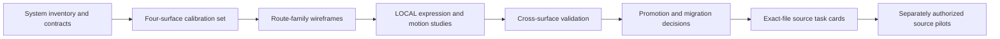

# Phase 5 Tasks: Niuva Frontend Experience and Design-System Blueprint

**Status:** Candidate — Context Only — Phase 5 and all executable blueprint
tasks Wave B–F completed; bounded source pilots are recorded through PR #296;
`SRC-EXPAND-01` remains separately gated; no broad source or delivery authority

**Date:** 19 August 2026

**Repository baseline:** `origin/main`
`b1142f1d0bf1edcad33498e71b6a950aa6039450`

**Scope:** Convert the owner-approved Design Brief, Information Architecture,
and `TOK-01` through `TOK-12` into bounded, dependency-ordered tasks for the
complete Niuva frontend. The plan covers component contracts, wireframes,
visual studies, prototypes, state and flow validation, and later exact-file
migration planning.

**Owner decision:** The owner approved `TOK-01` through `TOK-12`, approved this
Phase 5 task plan, and authorized Phase 6 only for `DS-01A` on 18 August 2026.
The owner subsequently approved the completed `DS-01A` ledger as the candidate
exact-SHA component and consumer record, then separately authorized `DS-01B`
on 18 August 2026. The owner then authorized `DS-02` through `DS-05` as one
documentation-only goal with independent self-review and one consolidated
owner-report. The owner then authorized execution of all executable Wave B–F
entries in this file as one Goal with independent self-review and one
consolidated owner-report on 18 August 2026. `DS-01B` through `DS-05` and
Wave B–F are complete only as candidate records for owner review. The bounded
Public, Commerce discovery, Account/Auth, Operations, and Customer Registration
source pilots are recorded in their task cards and merged PRs #279, #281, #284,
#288, #290, and #296; `SRC-EXPAND-01` remains untouched and separately gated.
These approvals do not authorize broad application redesign, canonical
promotion, deployment, readiness, or go-live.

## 1. Inputs and precedence

Read this plan after:

1. the canonical repository reading order in `AGENTS.md`;
2. [`DESIGN_BRIEF.md`](DESIGN_BRIEF.md);
3. [`INFORMATION_ARCHITECTURE.md`](INFORMATION_ARCHITECTURE.md);
4. [`DESIGN_TOKENS.md`](DESIGN_TOKENS.md);
5. the current component register, source, and tests as implementation
   evidence; and
6. this task plan.

Higher authority wins when a task conflicts with product, lifecycle, route,
privacy, evidence, accessibility, or design authority. A task identifier is
planning structure, not implementation authority.

## 2. Execution contract

### 2.1 Task size and sequence

- Execute tasks in order unless an explicit dependency permits otherwise.
- Complete one bounded task in one focused session. If its discovered file or
  route scope is too large, split it before design or source work begins.
- Confirm each task with the owner before starting it.
- Keep Public, Commerce, Account, and Operations source work in separate
  branches or worktrees.
- Design exploration stays in this `.design/` working set until an exact-file
  source task is separately approved.
- A route family may share a wireframe archetype, but every current route must
  be mapped to a named responsibility, state set, and exception.
- Indonesian and English counterparts are one responsibility with two complete
  language variants, not two unrelated page designs.

### 2.2 Required task record

Every executed task must record:

1. selected SHA, authority, objective, scope, and exclusions;
2. exact artifacts or files it reuses, modifies, and creates;
3. structure, visual hierarchy, interaction, and state coverage;
4. surface, lifecycle, privacy, authorization, and evidence restrictions;
5. responsive, accessibility, localization, and reduced-motion checks;
6. decisions accepted, rejected, held, or deferred;
7. verification passed or not run; and
8. rollback or discard path.

### 2.3 Gates

- **G0 — Task-plan approval:** owner approves this Phase 5 ordering.
- **G1 — Design-task start:** owner confirms one named Phase 6 task.
- **G2 — Design selection:** owner selects one reviewed direction;
  alternatives remain historical evidence.
- **G3 — Source task card:** exact files, consumers, checks, rollback, and
  exclusions are reviewed.
- **G4 — Source implementation:** separately authorized for one bounded
  surface and worktree.
- **G5 — Delivery:** stage, commit, push, PR, review-thread resolution, and
  merge remain separate approvals.

No gate implies the next one.

## 3. Current implementation snapshot

The snapshot exists only to prevent duplicate or speculative work:

- `58` concrete route declarations are present in `frontend/src/App.js`;
- `50` non-test component source files and `72` frontend test files are present
  under `frontend/src`;
- React 19, React Router, Tailwind, Radix wrappers, CVA, Lucide, Sonner, GSAP,
  Recharts, Jest/Testing Library, Playwright, and axe support already exist;
- Storybook is absent and is not proposed by this plan;
- `frontend/src/index.css` remains the single runtime token source;
- `Progress`, `ResponsiveTable`, `Separator`, `StatCard`, and `Tooltip` have no
  current application consumer and remain provisional;
- `Drawer` has no current application consumer and remains quarantined because
  its `vaul` boundary is undeclared; and
- current file existence, exports, or tests do not by themselves promote a
  component.

The inventory must be refreshed against the selected SHA when a later source
task starts.

## 4. Dependency map

This ordering keeps the system adjustable. Structure and state can be corrected
without prematurely freezing art direction; LOCAL expression can change
without renaming durable semantic roles.

## 5. Wave A — system inventory and component contracts

### - [x] DS-01A — Refresh the component and consumer ledger

**Objective:** Produce one exact-SHA ledger for every current shared primitive,
shared pattern, and surface/domain composition.

- **Reuse:** current component register, component exports, tests, package
  manifests, Brief, IA, and token contract.
- **Modify:** no application source.
- **Create:** `components/COMPONENT_STATUS.md`.
- **Structure/style/interaction:** record owner, layer, status, exact consumers,
  states, surface restrictions, and interaction evidence; do not redesign.
- **Complete when:** all current component source files are mapped; duplicate
  responsibilities, zero-consumer files, compatibility consumers, and
  quarantine reasons are explicit.
- **Verify:** source search, import graph spot-check, component/test
  reconciliation, and `git diff --check`.
- **Gate:** first Phase 6 task; listing does not promote or retire anything.
- **Execution record:** completed against `8555685c` on 18 August 2026 in
  [`components/COMPONENT_STATUS.md`](components/COMPONENT_STATUS.md). The
  owner approved the bounded ledger on the same date; that approval does not
  start `DS-01B`.

### - [x] DS-01B — Refresh the route and responsibility matrix

**Objective:** Map every current route declaration, compatibility alias,
reserved path, prototype, and catch-all to audience, job, lifecycle owner,
surface composition, shared mechanics, state set, and exception.

- **Reuse:** `App.js`, route tests, Brief, IA, current page files, and the
  DS-01A component ledger.
- **Modify:** no application source, route, redirect, or navigation.
- **Create:** `inventory/ROUTE_COMPONENT_MATRIX.md`.
- **Structure/style/interaction:** record entry, exit, safe return, locale,
  permission, empty/error/recovery, and current component relationships; do
  not redesign.
- **Complete when:** all concrete route declarations and every inventory-only
  alias, reserved path, and prototype have an explicit responsibility.
- **Verify:** route declaration count, redirect/protected-route test sampling,
  page import reconciliation, and `git diff --check`.
- **Gate:** listing a route does not activate, canonicalize, migrate, or delete
  it.
- **Execution record:** completed against `8555685c` on 18 August 2026 in
  [`inventory/ROUTE_COMPONENT_MATRIX.md`](inventory/ROUTE_COMPONENT_MATRIX.md).
  The matrix reconciles all `58` current non-wildcard paths, eight generated
  aliases, one wildcard, and 17 authority/inventory-only exact paths. It is
  awaiting owner review and does not start `DS-02`.

### - [x] DS-02 — Specify shared action and form primitives

**Objective:** Complete the NDS 13-field contract for Button, Label, Input,
Textarea, FormField, Select, Switch, Tabs, and the approved checkbox mechanic.

- **Reuse:** current APIs, semantic tokens, tests, and real Inquiry, auth,
  catalog, and settings consumers.
- **Modify:** no application source; retain current APIs unless a later
  breaking-change task is approved.
- **Create:** `components/SHARED_ACTION_FORM_SPEC.md`.
- **Structure/style/interaction:** anatomy, variants, content limits, input
  purpose, mouse/keyboard/touch behavior, visible labels, focus, disabled,
  validation, loading, and long-content behavior.
- **Complete when:** shared mechanics are separated from domain copy,
  persistence truth, password policy, consent, and mutation authority.
- **Verify:** at least two real consumer examples for every proposed shared
  role, 44px mobile target, focus visibility, 200% zoom, and ID/EN copy stress.
- **Gate:** no new component token or consumer is created by this spec.
- **Execution record:** completed and self-reviewed against `8555685c` on 18
  August 2026 in
  [`components/SHARED_ACTION_FORM_SPEC.md`](components/SHARED_ACTION_FORM_SPEC.md).
  All nine NDS records are complete. `Tabs` has one current consumer and is
  explicitly held rather than given a speculative second consumer. No source
  or new consumer was created.

### - [x] DS-03 — Specify overlays, feedback, and state regions

**Objective:** Define the shared perceivable and operable contract for Dialog,
AlertDialog, Alert, Sonner reinforcement, skeletons, EmptyState, ErrorState,
OperationalState, and SurfacePanel.

- **Reuse:** current adopted components, tests, and the approved complete state
  grammar.
- **Modify:** no source and no lifecycle labels.
- **Create:** `components/SHARED_FEEDBACK_STATE_SPEC.md`.
- **Structure/style/interaction:** visible in-page critical feedback, focus
  entry/return, Escape and dismissal rules, duplicate-submit prevention,
  loading hierarchy, conflict, permission, expired, offline, uncertain,
  recovery, and exact success ownership.
- **Complete when:** toast/live-region reinforcement cannot replace visible
  failure or success, and irreversible retry rules are domain-owned.
- **Verify:** keyboard sequence, screen-reader name/role/value notes, reduced
  motion, long error copy, and at least one Public plus one private consumer.
- **Gate:** Drawer remains excluded and quarantined.
- **Execution record:** completed and self-reviewed against `8555685c` on 18
  August 2026 in
  [`components/SHARED_FEEDBACK_STATE_SPEC.md`](components/SHARED_FEEDBACK_STATE_SPEC.md).
  Visible critical feedback, overlay focus/dismissal, state ownership,
  reduced motion, Public/private consumers, and the `Drawer`/`vaul` quarantine
  are explicit. No source or lifecycle label changed.

### - [x] DS-04 — Specify collection, record, and status mechanics

**Objective:** Define reusable mechanics for search, filters, reset, cursor or
load-more pagination, collection presentation, record identity, and status
presentation without merging domain lifecycles.

- **Reuse:** Input, Select, Table, Button, Badge presentation, loading/empty
  states, Retail catalog, owned-order lists, and Operations queues.
- **Modify:** no source; do not adopt zero-consumer `ResponsiveTable`,
  `Progress`, or `StatCard`.
- **Create:** `components/COLLECTION_RECORD_STATUS_SPEC.md`.
- **Structure/style/interaction:** query ownership, selected filter visibility,
  result count/status, reset, loading-more failure, return context, overflow,
  row/card action hierarchy, and domain status adapters.
- **Complete when:** Retail, Account, and Operations examples prove which
  mechanics are shared and which density/lifecycle meanings stay local.
- **Verify:** keyboard filtering, focus after reset/load-more, narrow-screen
  alternatives, empty versus error distinction, and stable URL/state notes.
- **Gate:** two visually similar statuses with different resources never count
  as one semantic consumer.
- **Execution record:** completed and self-reviewed against `8555685c` on 18
  August 2026 in
  [`components/COLLECTION_RECORD_STATUS_SPEC.md`](components/COLLECTION_RECORD_STATUS_SPEC.md).
  Query/filter/reset, collection states, narrow alternatives, record identity,
  safe return context, and resource-specific status adapters are explicit.
  `ResponsiveTable`, `Progress`, `Separator`, and `StatCard` remain
  provisional; no source or lifecycle label changed.

### - [x] DS-05 — Specify navigation, locale, and safe-return mechanics

**Objective:** Define shared mechanics and surface-owned composition for Public
navigation, Account navigation, Operations sidebar, locale selection, and safe
return after authentication or detail work.

- **Reuse:** current Navbar, PublicNavigation, OperationalNavigation, Layout,
  protected-route behavior, and approved route pairs.
- **Modify:** no source and no detailed Public-navigation promotion.
- **Create:** `components/NAVIGATION_LOCALE_RETURN_SPEC.md`.
- **Structure/style/interaction:** direct shallow Public destinations, no mega
  menu, current route, disclosure, mobile panel, Escape, outside click, focus
  return, stored language preference, exact translated counterpart, breadcrumb
  and queue-return context.
- **Complete when:** route visibility is explicitly separate from authorization
  and private routes never invent `/en` counterparts.
- **Verify:** desktop/mobile keyboard paths, ID/EN long labels,
  compact-on-scroll state, mobile menu state, and protected safe-return cases.
- **Gate:** no route, redirect, sitemap, or navigation composition is activated.
- **Execution record:** completed and self-reviewed against `8555685c` on 18
  August 2026 in
  [`components/NAVIGATION_LOCALE_RETURN_SPEC.md`](components/NAVIGATION_LOCALE_RETURN_SPEC.md).
  Public direct navigation, no mega-menu/accordion, locale counterparts and
  fallback, mobile focus/disclosure, surface-owned Operations navigation, and
  bounded customer/staff safe return are explicit. No source, route, redirect,
  or authorization behavior changed.

## 6. Wave B — four-surface calibration set

These tasks deliberately test one high-value or high-risk flow per surface
before the remaining route families inherit a pattern.

### - [x] PUB-01 — Wireframe the canonical Homepage hierarchy

**Objective:** Create low-fidelity desktop and mobile wireframes for the
approved Homepage information order without selecting a signature visual.

- **Reuse:** current factual copy/evidence, four equal Services, two journey
  choices, one five-stage process, Retail path, Contact summary, FAQ, and
  closing action.
- **Modify:** no application source and no canonical document.
- **Create:** `wireframes/public/HOME_STRUCTURE.md` plus static desktop and
  mobile plates.
- **Structure/style/interaction:** hierarchy, content measure, section pacing,
  navigation clearance, project evidence, CTA ownership, long-content, missing
  media, and reduced-motion static state.
- **Complete when:** no duplicate process rail, generic card parade, fabricated
  proof, FDM replacement, or checkout implication is introduced.
- **Verify:** 320/390/768/1024/1440 reasoning, heading order, 200% reflow,
  logo-hidden anti-template check, and ID/EN parity.
- **Depends on:** DS-01B and DS-05.
- **Execution record:** completed and self-reviewed on 18 August 2026 against
  the selected SHA, IA, and DS-05 in
  [`wireframes/public/HOME_STRUCTURE.md`](wireframes/public/HOME_STRUCTURE.md).
  Desktop/mobile static plates, heading/order, state, responsive, and
  anti-template boundaries are explicit; no source or FDM replacement was
  selected.

### - [x] PUB-02 — Compare bounded Public art-direction alternatives

**Objective:** Compare at most two high-fidelity, Niuva-specific treatments for
the PUB-01 structure while keeping durable tokens unchanged.

- **Reuse:** approved core and Public surface roles, Mona Sans, one bounded
  Bona Nova role, factual evidence, current assets, and selected structure.
- **Modify:** no runtime token or source file.
- **Create:** `visual-studies/public/HOME_ART_DIRECTION_A.md`,
  `HOME_ART_DIRECTION_B.md`, and comparison images or HTML specimens.
- **Structure/style/interaction:** composition, typography, material contrast,
  imagery, density, and bounded interaction moments; keep all page-specific
  values LOCAL.
- **Complete when:** first-order, second-order, and logo-hidden anti-template
  checks identify a defensible selected, held, or rejected direction.
- **Verify:** contrast, long-content, static/reduced behavior, asset truth, and
  no horizontal-line, bento, generic SaaS, or transferable agency default.
- **Depends on:** PUB-01 and approved output from DS-02 through DS-05.
- **Execution record:** completed and self-reviewed on 18 August 2026 in
  [`visual-studies/public/HOME_ART_DIRECTION_A.md`](visual-studies/public/HOME_ART_DIRECTION_A.md),
  [`visual-studies/public/HOME_ART_DIRECTION_B.md`](visual-studies/public/HOME_ART_DIRECTION_B.md),
  and the static comparison plate. Direction A is preferred for further
  calibration; Direction B remains held evidence. No runtime token/source
  change or final owner art-direction selection was made.

### - [x] PUB-03 — Prototype the Public B2B Inquiry flow

**Objective:** Produce a reviewable Contact prototype covering form entry
through persisted Inquiry acknowledgement and optional WhatsApp continuation.

- **Reuse:** approved fields, exact consent, validation, persistence contract,
  Inquiry UUID, response target, Public form primitives, and Contact routes.
- **Modify:** no API, schema, route, storage, provider, or application source.
- **Create:** artifacts under `prototypes/public/CONTACT_INQUIRY/` and a state
  matrix.
- **Structure/style/interaction:** ready, field validation, submitting,
  dependency failure, offline/uncertain, safe retry, recovery, exact success,
  UUID reference, and user-clicked WhatsApp only after persistence.
- **Complete when:** values are preserved safely, focus is managed, no public
  upload exists, and no false success, quote, price, ETA, or guarantee appears.
- **Verify:** keyboard-only flow, screen-reader feedback notes, 390/1440,
  ID/EN, long error text, refresh/retry semantics, and reduced motion.
- **Depends on:** DS-02 and DS-03.
- **Execution record:** completed and self-reviewed on 18 August 2026 in
  [`prototypes/public/CONTACT_INQUIRY/`](prototypes/public/CONTACT_INQUIRY/).
  Consent, UUID-after-persistence, visible failure/recovery/uncertain states,
  and optional post-persistence WhatsApp are explicit; no upload/API/provider
  or source behavior changed.

### - [x] COM-01 — Wireframe Retail catalog discovery

**Objective:** Define the catalog structure and complete collection states for
`/retail` and `/en/retail`.

- **Reuse:** current product/category evidence, collection mechanics, Public to
  Commerce boundary, and truthful availability.
- **Modify:** no source, API, price, inventory, provider, or route.
- **Create:** `wireframes/commerce/RETAIL_CATALOG.md` and state plates.
- **Structure/style/interaction:** purpose, category/filter controls, selected
  state, results, pagination/load-more, empty, unavailable, dependency error,
  recovery, special-needs handoff, and locale behavior.
- **Complete when:** discovery does not imply guest checkout or authoritative
  price, stock, ETA, or eligibility.
- **Verify:** mobile filters, keyboard reset/load-more, result focus, 200%
  reflow, ID/EN labels, and long product names.
- **Depends on:** DS-02 through DS-05.
- **Execution record:** completed and self-reviewed on 18 August 2026 in
  [`wireframes/commerce/RETAIL_CATALOG.md`](wireframes/commerce/RETAIL_CATALOG.md)
  and its state plate. Collection mechanics, mobile filters, no-match/error,
  truthful availability, and inactive transaction boundary are explicit.

### - [x] COM-02 — Wireframe Retail product evaluation

**Objective:** Define the product-detail hierarchy and next-action states for
`/retail/products/:slug`.

- **Reuse:** approved product evidence, RetailProductVisual, record identity,
  stored language preference, and return context.
- **Modify:** no source or transaction capability.
- **Create:** `wireframes/commerce/RETAIL_PRODUCT_DETAIL.md`.
- **Structure/style/interaction:** back context, product identity, approved
  media, factual variants, publication, availability, price/quote status,
  loading, not found, unavailable, dependency recovery, and one truthful next
  action.
- **Complete when:** private upload, payment, fulfillment, and production
  tracking remain visibly inactive unless separately authorized.
- **Verify:** focus after navigation/recovery, image/caption alternatives,
  narrow layout, long variants, and permission-neutral public projection.
- **Depends on:** COM-01 and DS-04.
- **Execution record:** completed and self-reviewed on 18 August 2026 in
  [`wireframes/commerce/RETAIL_PRODUCT_DETAIL.md`](wireframes/commerce/RETAIL_PRODUCT_DETAIL.md).
  Product identity, factual media, unavailable/stale/error states, return
  context, and inactive private/transaction capability are explicit.

### - [x] AUTH-01 — Compare customer and staff login flows

**Objective:** Wireframe the shared authentication mechanics and distinct
customer/staff audience, destination, recovery, and privacy meanings.

- **Reuse:** AuthShell/AuthCard, form primitives, `/login`, `/admin/login`,
  protected-route context, and current recovery entry.
- **Modify:** no auth provider, session, role, route, or source.
- **Create:** `wireframes/auth/LOGIN_SAFE_RETURN.md`.
- **Structure/style/interaction:** audience identity, credentials, validation,
  dependency error, disabled/loading, non-disclosing errors, recovery link,
  permission-safe redirect, and safe return.
- **Complete when:** customer and staff are not visually or semantically
  collapsed despite primitive reuse.
- **Verify:** keyboard/autofill/password-manager notes, focus, 390/1440,
  invalid/expired session, and ID/EN long copy.
- **Depends on:** DS-02, DS-03, and DS-05.
- **Execution record:** completed and self-reviewed on 18 August 2026 in
  [`wireframes/auth/LOGIN_SAFE_RETURN.md`](wireframes/auth/LOGIN_SAFE_RETURN.md).
  Customer/staff semantics, non-disclosing errors, focus/loading, and bounded
  return destinations remain distinct; no auth/provider/source behavior changed.

### - [x] ACC-01 — Prototype customer dashboard to owned-order detail

**Objective:** Produce the Account calibration flow from `/dashboard` to
`/orders/:id` and back with customer-safe data projection.

- **Reuse:** current dashboard/order pages, SurfacePanel, state components,
  collection/record mechanics, and domain status presentation.
- **Modify:** no API, authorization, order lifecycle, or source.
- **Create:** artifacts under `prototypes/account/OWNED_ORDER_FLOW/` and a
  projection checklist.
- **Structure/style/interaction:** identity, owned summary, record list, empty,
  loading/error/retry, detail reference/status, allowed commercial/file/payment
  history, forbidden/not-found, return context, and Retail route.
- **Complete when:** internal cost, margin, supplier, profit, and notes are
  excluded and route hiding is not presented as authorization.
- **Verify:** owned/unowned cases, stale session, keyboard return, 390/1440,
  200% reflow, and customer-safe screenshots.
- **Depends on:** AUTH-01, DS-03, and DS-04.
- **Execution record:** completed and self-reviewed on 18 August 2026 in
  [`prototypes/account/OWNED_ORDER_FLOW/`](prototypes/account/OWNED_ORDER_FLOW/).
  Customer-safe projection, owned/unowned, stale session, recovery, and
  permitted history/action boundaries are explicit; no source/API/permission
  change occurred.

### - [x] OPS-01 — Prototype Inquiry queue to record detail

**Objective:** Establish the Operations queue/detail calibration pattern using
`/admin/inquiries` and `/admin/inquiries/:id`.

- **Reuse:** OperationalLayout/navigation, responsive table alternatives,
  SurfacePanel, status adapters, filters, confirmation, and Inquiry lifecycle.
- **Modify:** no role, permission, API, mutation, or source.
- **Create:** artifacts under `prototypes/operations/INQUIRY_QUEUE_DETAIL/` and
  a role-projection matrix.
- **Structure/style/interaction:** role scope, filters, count/cursor, rows,
  urgent/aged context, record identity/status, permissible action, history,
  permission, stale/conflict, uncertain mutation, retry, and return-to-queue.
- **Complete when:** visual hierarchy helps triage without fake KPI, broad
  audit access, or route-based authorization.
- **Verify:** keyboard table/list flow, 390/768/1024/1440, dense long content,
  focus after mutation/recovery, and role-safe variants.
- **Depends on:** DS-03 through DS-05.
- **Execution record:** completed and self-reviewed on 18 August 2026 in
  [`prototypes/operations/INQUIRY_QUEUE_DETAIL/`](prototypes/operations/INQUIRY_QUEUE_DETAIL/).
  Role projection, collection states, Inquiry lifecycle, conflict/uncertain
  recovery, and return-to-queue context are explicit; no role/API/mutation or
  source behavior changed.

## 7. Wave C — route-family wireframes and flows

### - [x] PUB-04 — Wireframe About and four-equal-Services pages

**Objective:** Define the content-page family for `/tentang`, `/en/about`,
`/layanan`, and `/en/services`.

- **Reuse:** factual identity/evidence, equal Service authority, Public
  navigation, and selected Public art direction.
- **Modify:** no source or factual claim.
- **Create:** `wireframes/public/ABOUT_SERVICES_FAMILY.md`.
- **Structure/style/interaction:** identity, approach, evidence, four equal
  detail actions, missing evidence, long content, Contact handoff, and locale
  parity without a repeated-card default.
- **Complete when:** no Service is demoted and no invented history, award,
  capacity, team, or production claim appears.
- **Verify:** evidence provenance checklist, hierarchy comparison, ID/EN,
  320–1440, and 200% reflow.
- **Depends on:** selected PUB-02 direction.
- **Execution record:** completed and self-reviewed on 18 August 2026 in
  [`wireframes/public/ABOUT_SERVICES_FAMILY.md`](wireframes/public/ABOUT_SERVICES_FAMILY.md).
  About and four equal Services remain distinct but compatible; no factual
  claims or source changed.

### - [x] PUB-05 — Wireframe the project-evidence archive

**Objective:** Define the archive for `/proyek` and `/en/projects` without
activating reserved project-detail routes.

- **Reuse:** published factual evidence, media/caption mechanics, collection
  states, and Contact/archive recovery.
- **Modify:** no CMS, asset, route, sitemap, or source.
- **Create:** `wireframes/public/PROJECT_EVIDENCE_ARCHIVE.md`.
- **Structure/style/interaction:** context, challenge, contribution, output,
  capability proven, missing imagery, long caption, locale readiness,
  loading/error/empty, and future pagination.
- **Complete when:** cards do not link to reserved detail paths and conceptual
  visuals cannot substantiate Niuva work.
- **Verify:** evidence ledger sampling, keyboard media/action access, ID/EN,
  responsive density, and no hover-only facts.
- **Depends on:** PUB-02 and DS-04.
- **Execution record:** completed and self-reviewed on 18 August 2026 in
  [`wireframes/public/PROJECT_EVIDENCE_ARCHIVE.md`](wireframes/public/PROJECT_EVIDENCE_ARCHIVE.md).
  Provenance, captions, missing media, reserved detail paths, and collection
  states are explicit; no CMS, asset, route, or source changed.

### - [x] PUB-06 — Wireframe FAQ, Privacy, and Not Found support family

**Objective:** Define lightweight support content for `/faq`, `/en/faq`,
`/privasi`, `/en/privacy`, and the locale-aware catch-all.

- **Reuse:** Public navigation, content typography, disclosure where justified,
  owned recovery links, and policy revision facts.
- **Modify:** no policy, consent, indexing, analytics, or route behavior.
- **Create:** `wireframes/public/SUPPORT_CONTENT_FAMILY.md`.
- **Structure/style/interaction:** topic groups, optional volume-justified
  search, answer and related destination, empty/error, policy scope/revision,
  and clear missing-route recovery.
- **Complete when:** FAQ does not replace policy/account support, search does
  not become universal navigation, and Privacy does not hide consent.
- **Verify:** heading/landmark order, keyboard disclosure/search, long legal
  text, ID/EN, 320–1440, and 200% reflow.
- **Depends on:** DS-04, DS-05, and selected PUB-02 direction.
- **Execution record:** completed and self-reviewed on 18 August 2026 in
  [`wireframes/public/SUPPORT_CONTENT_FAMILY.md`](wireframes/public/SUPPORT_CONTENT_FAMILY.md).
  FAQ, Privacy, and Not Found retain separate content/recovery responsibilities;
  no policy, indexing, route, or source changed.

### - [x] COM-03 — Model the inactive transaction and quote boundary

**Objective:** Create annotated flow diagrams and state wireframes for future
configuration, authentication, private upload, server revalidation,
`quote_required`, and checkout eligibility without assigning URLs or
activating capabilities.

- **Reuse:** approved Retail Request, Assisted Retail Offer, Retail Order, B2B
  Inquiry, account-required, mixed-cart, and context-preservation contracts.
- **Modify:** no runtime route, API, schema, upload, storage, payment, provider,
  reservation, or source.
- **Create:** `flows/commerce/TRANSACTION_QUOTE_BOUNDARY.md`.
- **Structure/style/interaction:** anonymous draft, authentication boundary,
  stale revalidation, eligible/direct versus quote-required split, request
  reference, uncertain irreversible result, and safe next action.
- **Complete when:** no Order, reservation, payment attempt, paid state, or
  checkout total is fabricated by the flow.
- **Verify:** lifecycle/resource labels, duplicate-effect prevention, mixed
  cart, expired offer, stale file/version, and customer-safe projection.
- **Depends on:** COM-01, COM-02, AUTH-01, and ACC-01.
- **Execution record:** completed and self-reviewed on 18 August 2026 in
  [`flows/commerce/TRANSACTION_QUOTE_BOUNDARY.md`](flows/commerce/TRANSACTION_QUOTE_BOUNDARY.md).
  Account boundary, revalidation, mixed-cart, `quote_required`, offer, stale,
  and uncertain effects are explicit; no URL/capability/API changed.

### - [x] AUTH-02 — Wireframe the password-recovery sequence

**Objective:** Define request, acknowledgement, token validation, reset,
success, error, expiry, and restart across the current recovery routes.

- **Reuse:** auth primitives, state regions, password policy evidence, and
  customer/staff destination rules.
- **Modify:** no token policy, email provider, session, or source.
- **Create:** `wireframes/auth/PASSWORD_RECOVERY_SEQUENCE.md`.
- **Structure/style/interaction:** non-enumerating acknowledgement, invalid or
  expired token, validation, loading, dependency failure, success, correct
  login destination, and safe restart.
- **Complete when:** account existence and protected details are never exposed.
- **Verify:** keyboard/focus progression, password-manager notes, long errors,
  390/1440, and reduced motion.
- **Depends on:** AUTH-01 and DS-03.
- **Execution record:** completed and self-reviewed on 18 August 2026 in
  [`wireframes/auth/PASSWORD_RECOVERY_SEQUENCE.md`](wireframes/auth/PASSWORD_RECOVERY_SEQUENCE.md).
  Non-enumerating request, token expiry, reset, success, error, and safe
  restart are explicit; no provider/session/source behavior changed.

### - [x] AUTH-03 — Wireframe staff invitation acceptance

**Objective:** Define invitation identity, validation, acceptance, expiry,
permission-safe success, and recovery for `/staff-invitation`.

- **Reuse:** AuthShell/AuthCard, form/state primitives, and current invitation
  authority.
- **Modify:** no role, invitation, email, identity, or source behavior.
- **Create:** `wireframes/auth/STAFF_INVITATION.md`.
- **Structure/style/interaction:** bounded invitation context, loading,
  validation, expired/used/invalid, acceptance, dependency uncertainty,
  success, and correct staff-login path.
- **Complete when:** invitation UI cannot grant roles or prove activation by
  itself.
- **Verify:** privacy-safe errors, keyboard/focus, 390/1440, and retry
  semantics.
- **Depends on:** AUTH-01 and AUTH-02.
- **Execution record:** completed and self-reviewed on 18 August 2026 in
  [`wireframes/auth/STAFF_INVITATION.md`](wireframes/auth/STAFF_INVITATION.md).
  Invitation validation/expiry/acceptance cannot grant roles or prove session;
  no identity, email, route, or source behavior changed.

### - [x] OPS-02 — Wireframe the role-aware Operations work home

**Objective:** Define `/admin` as a work-oriented entry with real role scope,
urgent/owned work, age/exception meaning, and next action.

- **Reuse:** Operations navigation, queue/detail calibration, factual current
  resources, and Product-register tokens.
- **Modify:** no source, permissions, metric definitions, or data.
- **Create:** `wireframes/operations/ROLE_WORK_HOME.md`.
- **Structure/style/interaction:** role context, prioritized work, exceptions,
  loading/empty/error/permission, and direct queue/detail actions.
- **Complete when:** no invented KPI, decorative telemetry, or Public campaign
  composition appears.
- **Verify:** role variants, data-density stress, 390/768/1024/1440, keyboard
  navigation, and no protected-detail leakage.
- **Depends on:** OPS-01.
- **Execution record:** completed and self-reviewed on 18 August 2026 in
  [`wireframes/operations/ROLE_WORK_HOME.md`](wireframes/operations/ROLE_WORK_HOME.md).
  Role work, factual age/exception, permission, and density boundaries are
  explicit; no KPI, data, permission, or source changed.

### - [x] OPS-03 — Expand the Inquiry pattern to Quote and Project work

**Objective:** Map the queue/detail/revision pattern to B2B Quote and Project
routes while preserving separate resources and lifecycle meanings.

- **Reuse:** OPS-01, revision/editor mechanics, status adapters, confirmation,
  and history.
- **Modify:** no source, lifecycle, commercial rule, or authorization.
- **Create:** `wireframes/operations/B2B_QUOTE_PROJECT_FAMILY.md`.
- **Structure/style/interaction:** quote queue/detail/revision, version
  identity, guarded submit, Project queue/detail, handoff context,
  stale/conflict, permission, recovery, and history.
- **Complete when:** Inquiry, Quote, and Project are not flattened into one
  status or record.
- **Verify:** role/action matrix, revision conflict, long commercial content,
  keyboard/focus, and customer-safe versus internal projections.
- **Depends on:** OPS-01 and DS-02 through DS-04.
- **Execution record:** completed and self-reviewed on 18 August 2026 in
  [`wireframes/operations/B2B_QUOTE_PROJECT_FAMILY.md`](wireframes/operations/B2B_QUOTE_PROJECT_FAMILY.md).
  Inquiry, Quote, and Project remain separate resources and revisions; no
  lifecycle, authorization, or source changed.

### - [x] OPS-04 — Define Retail Order Operations

**Objective:** Wireframe Retail Order queue/detail and existing compatibility
order handling without changing lifecycle or ownership.

- **Reuse:** queue/detail calibration, RetailOrderStatusBadge presentation,
  confirmation, history, and conflict recovery.
- **Modify:** no Order, payment, reservation, fulfillment, or source logic.
- **Create:** `wireframes/operations/RETAIL_ORDER_FAMILY.md`.
- **Structure/style/interaction:** filters, safe commercial summary, allowed
  actions, payment/fulfillment facts, uncertain mutations, conflict, retry,
  return context, and compatibility-route notice.
- **Complete when:** payment/provider success and production progress remain
  authoritative domain facts, not visual inference.
- **Verify:** role matrix, customer/internal data boundary, dense mobile/tablet,
  keyboard actions, and duplicate-effect prevention.
- **Depends on:** OPS-01 and COM-03.
- **Execution record:** completed and self-reviewed on 18 August 2026 in
  [`wireframes/operations/RETAIL_ORDER_FAMILY.md`](wireframes/operations/RETAIL_ORDER_FAMILY.md).
  Retail Order/legacy Order separation, payment/fulfillment uncertainty, and
  role boundaries are explicit; no Order/provider/source logic changed.

### - [x] OPS-05 — Define catalog, material, inventory, and work-order work

**Objective:** Create surface-native wireframe archetypes for catalog
list/editor, material/inventory collections, stock movement, restock context,
and work-order queue/detail.

- **Reuse:** collection/editor/state specs, current routes, status adapters,
  confirmation, and history.
- **Modify:** no inventory arithmetic, transaction, production, or source.
- **Create:** `wireframes/operations/PRODUCT_PRODUCTION_FAMILY.md`.
- **Structure/style/interaction:** filters, record/version identity, guarded
  edits, quantity/reason/reference, authoritative result, movement history,
  conflict, permission, and work execution.
- **Complete when:** inventory movement and work-order state keep their own
  domain contracts; restock remains contextual utility.
- **Verify:** numeric/input error cases, stale/version conflict, dense tables,
  390–1440, keyboard/focus, and history preservation.
- **Depends on:** OPS-01 and DS-02 through DS-04.
- **Execution record:** completed and self-reviewed on 18 August 2026 in
  [`wireframes/operations/PRODUCT_PRODUCTION_FAMILY.md`](wireframes/operations/PRODUCT_PRODUCTION_FAMILY.md).
  Catalog, material, inventory, stock movement, restock utility, and Work Order
  contracts remain distinct; no arithmetic, mutation, or source changed.

### - [x] OPS-06 — Define Publishing work

**Objective:** Wireframe portfolio and content list/editor lifecycles with
version, locale, evidence provenance, publish, and rollback boundaries.

- **Reuse:** editor/state specs, media/evidence mechanics, current portfolio
  and content routes, and publishing statuses.
- **Modify:** no CMS schema, asset, route, publication, or source.
- **Create:** `wireframes/operations/PUBLISHING_FAMILY.md`.
- **Structure/style/interaction:** draft/published context, factual content,
  asset provenance, locale readiness, preview/diff, guarded publish, history,
  conflict, permission, failure, and rollback gate.
- **Complete when:** missing translation/assets and unverified evidence remain
  explicit and publishing cannot be inferred from a toast.
- **Verify:** long bilingual content, asset metadata, keyboard editor flow,
  version conflict, and screen-reader feedback notes.
- **Depends on:** PUB-05, OPS-01, and DS-03.
- **Execution record:** completed and self-reviewed on 18 August 2026 in
  [`wireframes/operations/PUBLISHING_FAMILY.md`](wireframes/operations/PUBLISHING_FAMILY.md).
  Provenance, locale readiness, version, guarded publication, conflict, and
  rollback boundaries are explicit; no CMS/asset/source behavior changed.

### - [x] OPS-07 — Define Governance and notification utilities

**Objective:** Wireframe users, customers, settings, communication,
notification center/bell, and compatibility contacts as governed utilities.

- **Reuse:** collection/detail/form/state specs, confirmation, protected
  projection, and notification mechanics.
- **Modify:** no role, permission, identity, settings, communication provider,
  or source.
- **Create:** `wireframes/operations/GOVERNANCE_UTILITY_FAMILY.md`.
- **Structure/style/interaction:** current values, permission, guarded
  mutation, audit-safe result, notification read/context behavior, empty/error,
  and compatibility ownership.
- **Complete when:** route visibility is not authorization and broad audit or
  customer-private detail is not exposed.
- **Verify:** role matrix, confirmation/recovery, keyboard/focus, long settings
  copy, and append-oriented history.
- **Depends on:** OPS-01 and DS-02 through DS-05.
- **Execution record:** completed and self-reviewed on 18 August 2026 in
  [`wireframes/operations/GOVERNANCE_UTILITY_FAMILY.md`](wireframes/operations/GOVERNANCE_UTILITY_FAMILY.md).
  Users, customers, settings, communication, notifications, and compatibility
  utilities retain permission/projection boundaries; no source/provider changed.

### - [x] OPS-08 — Evaluate a bounded Operations dashboard grid

**Objective:** Test whether unequal real work-home modules benefit from a LOCAL
`OperationsDashboardGrid`, including a non-bento control alternative.

- **Reuse:** accepted OPS-02 information hierarchy and current factual data
  availability only.
- **Modify:** no shared primitive, token, metric, data, or source.
- **Create:** `visual-studies/operations/WORK_HOME_GRID_COMPARISON.md`.
- **Structure/style/interaction:** compare hierarchy, scan order, module
  priority, resizing, loading/empty/error, and authorized drill-down.
- **Complete when:** a selected or rejected decision is evidence-based; no
  fake KPI, decorative telemetry, or transfer to queues/forms/details occurs.
- **Verify:** logo-hidden/Product-register critique, 390/768/1024/1440, 200%
  reflow, keyboard order, and information-density review.
- **Depends on:** accepted OPS-02; remains LOCAL even if selected.
- **Execution record:** completed and self-reviewed on 18 August 2026 in
  [`visual-studies/operations/WORK_HOME_GRID_COMPARISON.md`](visual-studies/operations/WORK_HOME_GRID_COMPARISON.md).
  Priority-column A is preferred; unequal grid B remains held LOCAL. No shared
  token, metric, primitive, data, or source changed.

## 8. Wave D — LOCAL expression, evidence, and motion

### - [x] EXP-01 — Build a donor-admission ledger

**Objective:** Review any proposed React Bits, Magic UI, or other donor by
concrete Niuva need instead of catalog popularity.

- **Reuse:** donor levels in the Brief and current native/CSS/GSAP capability.
- **Modify:** no package manifest, dependency, or source.
- **Create:** `experiments/DONOR_ADMISSION_LEDGER.md`.
- **Structure/style/interaction:** problem solved, reference-only versus local
  adaptation versus runtime dependency, provenance, license, bundle,
  maintenance, accessibility, reduced motion, owner, removal plan, and
  fallback.
- **Complete when:** every donor is accepted, rejected, or held with a named
  consumer and no donor becomes identity by default.
- **Verify:** current dependency/source capability comparison and license/source
  link review when a donor is actually proposed.
- **Depends on:** a selected page or component need; no speculative catalog
  scan.
- **Execution record:** completed and self-reviewed on 18 August 2026 in
  [`experiments/DONOR_ADMISSION_LEDGER.md`](experiments/DONOR_ADMISSION_LEDGER.md).
  React Bits/Magic UI are reference-only/held, existing GSAP is bounded, and
  no dependency, license, package, or source changed.

### - [x] EXP-02 — Prototype bounded motion contracts

**Objective:** Prototype only motion that explains hierarchy, continuity,
feedback, process, or media state for accepted designs.

- **Reuse:** 0/120/180/280ms core grammar, CSS-first behavior, current bounded
  GSAP support, and accepted component/page structure.
- **Modify:** no runtime source or dependency.
- **Create:** `experiments/MOTION_CONTRACTS.md` plus local static/animated
  specimens where needed.
- **Structure/style/interaction:** trigger, duration, easing, interruption,
  offscreen/hidden behavior, focus continuity, complete static state, and
  per-contract reduced behavior.
- **Complete when:** there is no scroll hijacking, universal reveal, hover-only
  meaning, ornamental delay, bounce, or animation required to understand state.
- **Verify:** normal/reduced comparison, keyboard path, low-width behavior, and
  performance notes.
- **Depends on:** selected designs and EXP-01 only when a donor is proposed.
- **Execution record:** completed and self-reviewed on 18 August 2026 in
  [`experiments/MOTION_CONTRACTS.md`](experiments/MOTION_CONTRACTS.md) and its
  CSS-only specimen. Core timing, interruption, static/reduced behavior,
  offscreen rules, and Public/private boundaries are explicit; no runtime
  source or dependency changed.

### - [x] EXP-03 — Define evidence and supporting-visual language

**Objective:** Establish reusable presentation rules for factual
project/product evidence and separately labelled conceptual or explanatory
visuals.

- **Reuse:** provenance contract, current approved assets, figure/caption
  semantics, Public and Commerce visual studies.
- **Modify:** no asset rights, factual claims, CMS schema, or source.
- **Create:** `visual-studies/EVIDENCE_VISUAL_LANGUAGE.md`.
- **Structure/style/interaction:** caption visibility, crop/derivative note,
  alt text, missing-media fallback, gallery behavior, factual claim boundary,
  and labelled conceptual support.
- **Complete when:** generated, stock, or conceptual imagery cannot visually
  masquerade as Niuva project evidence.
- **Verify:** sample provenance record, no hover-only facts, keyboard gallery,
  responsive crops, and reduced-motion fallback.
- **Depends on:** PUB-05 and COM-02.
- **Execution record:** completed and self-reviewed on 18 August 2026 in
  [`visual-studies/public/EVIDENCE_VISUAL_LANGUAGE.md`](visual-studies/public/EVIDENCE_VISUAL_LANGUAGE.md).
  Evidence/supporting classes, provenance fields, captions, alt text, missing
  media, and rights boundaries are explicit; no asset or claim was migrated.

## 9. Wave E — cross-surface validation and promotion review

### - [x] QA-01 — Run responsive and localization coverage

**Objective:** Validate the four accepted calibration packets at the agreed
resilience, mobile, intermediate, compact, and wide widths before route-family
patterns are treated as reusable.

- **Reuse:** accepted artifacts and ID/EN content.
- **Modify:** design artifacts only for verified defects.
- **Create:** `validation/RESPONSIVE_LOCALIZATION_MATRIX.md`.
- **Coverage:** 320, 390, 768, 1024, 1440px, 200% zoom/reflow, long ID/EN,
  overflow, target size, critical action, and locale-context preservation.
- **Complete when:** P0/P1 layout and localization defects are closed or the
  affected artifact returns to its owning task.
- **Verify:** repeatable screenshots and measurements bound to artifact
  version.
- **Depends on:** accepted Wave B artifacts; each Wave C task retains its own
  equivalent checks.

- **Execution record:** completed and self-reviewed on 18 August 2026 in
  [`validation/RESPONSIVE_LOCALIZATION_MATRIX.md`](validation/RESPONSIVE_LOCALIZATION_MATRIX.md).
  Width, zoom, locale, long-content, overflow, target, and critical-action
  coverage are recorded; runtime evidence is explicitly held for G3/G4.

### - [x] QA-02 — Run accessibility and complete-state coverage

**Objective:** Compare semantics, interaction, state visibility, and recovery
across one accepted calibration flow per surface.

- **Reuse:** accepted designs and component/state contracts.
- **Modify:** design artifacts only for verified defects.
- **Create:** `validation/ACCESSIBILITY_STATE_MATRIX.md`.
- **Coverage:** landmarks/headings, labels, names/roles/values, keyboard, focus,
  focus return, touch, contrast, color independence, reduced motion, loading,
  empty, validation/system error, conflict, permission, expired, offline,
  uncertain, recovery, and success.
- **Complete when:** P0/P1 defects are closed and no critical state exists only
  in a toast or live region.
- **Verify:** manual keyboard review, contrast measurement, axe where runnable,
  and state-by-state evidence.
- **Depends on:** DS-02 through DS-05 and accepted Wave B artifacts; each Wave
  C task retains its own equivalent checks.

- **Execution record:** completed and self-reviewed on 18 August 2026 in
  [`validation/ACCESSIBILITY_STATE_MATRIX.md`](validation/ACCESSIBILITY_STATE_MATRIX.md).
  Semantics, keyboard/focus, complete states, reduced motion, and visible
  critical feedback are recorded; runtime checks remain pending.

### - [x] QA-03 — Audit truth, privacy, lifecycle, and authorization

**Objective:** Confirm on the calibration set and COM-03 that visual design has
not created false product, provider, evidence, lifecycle, or permission
meaning.

- **Reuse:** canonical authority, Brief, IA, domain decisions, and accepted
  designs.
- **Modify:** design artifacts only for verified conflicts.
- **Create:** `validation/TRUTH_PRIVACY_LIFECYCLE_AUDIT.md`.
- **Coverage:** Inquiry persistence/UUID, Retail/account boundaries,
  `quote_required`, customer-safe projection, role enforcement, evidence
  provenance, inactive capabilities, and uncertain irreversible actions.
- **Complete when:** every finding is tied to route/artifact/state and all
  P0/P1 conflicts are closed.
- **Verify:** authority-to-artifact traceability and domain-state walkthroughs.
- **Depends on:** PUB-03, COM-01 through COM-03, ACC-01, and OPS-01; later
  route-family tasks repeat the applicable checklist.

- **Execution record:** completed and self-reviewed on 18 August 2026 in
  [`validation/TRUTH_PRIVACY_LIFECYCLE_AUDIT.md`](validation/TRUTH_PRIVACY_LIFECYCLE_AUDIT.md).
  Inquiry, Retail, Account, Operations, evidence, locale, and uncertain-effect
  boundaries are traced; server/provider/runtime enforcement remains held.

### - [x] QA-04 — Run Impeccable and anti-template critique

**Objective:** Red-team the accepted calibration artifacts for Niuva
specificity, surface fitness, hierarchy, density, typography, color, and
interaction before their patterns expand.

- **Reuse:** Impeccable Brand register for Public and Product register for
  Commerce, Account, Auth, and Operations.
- **Modify:** only the owning design artifact after a documented finding.
- **Create:** `validation/VISUAL_CRITIQUE_REGISTER.md`.
- **Coverage:** first-order, second-order, logo-hidden, repeated-card, tiny
  eyebrow, decorative line/number, bento misuse, glass/gradient/dark-mode,
  fake metric, generic hero, and unjustified motion checks.
- **Complete when:** P0/P1 findings are closed, P2/P3 follow-ups are recorded,
  and critique has a stopping rule.
- **Verify:** screenshots at 390 and 1440px minimum plus side-by-side surface
  comparison.
- **Depends on:** selected Wave B visual artifacts and QA-01 through QA-03
  evidence; each later visual family receives its own bounded critique.

- **Execution record:** completed and self-reviewed on 18 August 2026 in
  [`validation/VISUAL_CRITIQUE_REGISTER.md`](validation/VISUAL_CRITIQUE_REGISTER.md).
  Brand/Product registers, anti-template checks, and stopping rules are
  recorded; no runtime screenshot claim was made.

### - [x] QA-05 — Decide component and token promotion status

**Objective:** Review candidate components, patterns, surface aliases, and
LOCAL values only after consumer and validation evidence exists.

- **Reuse:** DS-01A ledger, NDS 13-field specs, two-real-consumer rule, QA
  evidence, compatibility and retirement gates.
- **Modify:** candidate status ledgers only; no runtime source.
- **Create:** `decisions/PROMOTION_REVIEW.md`.
- **Structure/style/interaction:** adopted, provisional, quarantined,
  compatibility, retirement candidate, or LOCAL; include owner, consumers,
  semantic meaning, restrictions, migration, rollback, and unresolved evidence.
- **Complete when:** presence, visual similarity, or repeated selectors within
  one page are never treated as adoption proof.
- **Verify:** exact consumer count and semantic-meaning comparison.
- **Depends on:** QA-01 through QA-04.

- **Execution record:** completed and self-reviewed on 18 August 2026 in
  [`decisions/PROMOTION_REVIEW.md`](decisions/PROMOTION_REVIEW.md). Adopted,
  held, provisional, quarantined, compatibility, and LOCAL statuses retain
  consumer/evidence boundaries; no runtime promotion occurred.

## 10. Wave F — later migration planning

These tasks are planning-only until G3. They may create exact-file task cards
but may not change application source. A later, separately authorized source
execution is recorded explicitly where it occurred; this planning ledger does
not grant runtime authority by itself.

### - [x] MIG-01 — Plan the Public source pilot

**Objective:** Choose the smallest representative Public slice that tests the
accepted contracts without mixing another surface.

- **Reuse:** accepted designs, QA evidence, route/component ledger, current
  source/tests, and actual consumer ownership.
- **Modify:** no source.
- **Create:** bounded exact-file candidate task cards under `migration/public/`
  when a Public slice crosses a distinct lifecycle owner; MIG-01 is the shell/
  navigation card and MIG-01B is the Contact/Inquiry split card.
- **Complete when:** the card has objective, exact files, exclusions,
  acceptance criteria, tests/browser evidence, rollback, owner, and delivery
  gates.
- **Verify:** fresh `origin/main`, overlap/worktree check, exact consumers,
  dependency audit, and no capability activation.
- **Depends on:** QA-05.

- **Execution record:** completed and self-reviewed on 18 August 2026 in
  [`migration/public/PUBLIC_SOURCE_PILOT_TASK_CARD.md`](migration/public/PUBLIC_SOURCE_PILOT_TASK_CARD.md)
  and the lifecycle-separated
  [`migration/public/PUBLIC_CONTACT_INQUIRY_SOURCE_PILOT_TASK_CARD.md`](migration/public/PUBLIC_CONTACT_INQUIRY_SOURCE_PILOT_TASK_CARD.md).
  The amendment narrows MIG-01 to Homepage shell/navigation and gives Contact/
  Inquiry its own exact files, tests, failure states, and lifecycle boundary.
  MIG-01 shell/navigation was then implemented and merged in PR #279. MIG-01B
  was subsequently implemented in its four exact files and merged in PR #281;
  no other surface or capability was activated.

### - [x] MIG-02 — Plan the Commerce source pilot

**Objective:** Choose the smallest representative Commerce slice that tests
catalog or product-detail contracts without activating transaction capability.

- **Reuse:** accepted Commerce designs, QA evidence, route/component ledger,
  current source/tests, and actual consumer ownership.
- **Modify:** no source.
- **Create:** one exact-file candidate task card under `migration/commerce/`.
- **Complete when:** the card names exact files, inactive-capability
  exclusions, acceptance criteria, tests/browser evidence, rollback, owner,
  and delivery gates.
- **Verify:** fresh `origin/main`, overlap/worktree check, exact consumers,
  dependency audit, and no checkout/upload/payment/provider activation.
- **Depends on:** QA-05.

- **Execution record:** completed and self-reviewed on 18 August 2026 in
  [`migration/commerce/COMMERCE_SOURCE_PILOT_TASK_CARD.md`](migration/commerce/COMMERCE_SOURCE_PILOT_TASK_CARD.md).
  The 18 August G3 review rebaselined the card to
  `8372c4ecf3af69cf2c15e9b9f12a166a750b0cfe`, added the necessary locale
  helper, translation, and Retail surface-contract test paths, and recorded
  the retained unprefixed product-detail route. G4 remains a separate source
  authorization; no checkout, upload, payment, provider, route, or source
  activation occurred.

### - [x] MIG-03 — Plan the Account/Auth source pilot

**Objective:** Choose the smallest representative Account or Auth slice that
tests safe return, state, and customer-safe projection.

- **Reuse:** accepted Account/Auth designs, QA evidence, route/component
  ledger, current source/tests, and actual consumer ownership.
- **Modify:** no source.
- **Create:** one exact-file candidate task card under `migration/account/`.
- **Complete when:** the card names exact files, privacy/authorization
  exclusions, acceptance criteria, tests/browser evidence, rollback, owner,
  and delivery gates.
- **Verify:** fresh `origin/main`, overlap/worktree check, projection cases,
  exact consumers, and no identity/provider activation.
- **Depends on:** QA-05.

- **Execution record:** completed and self-reviewed on 18 August 2026 in
  [`migration/account/ACCOUNT_AUTH_SOURCE_PILOT_TASK_CARD.md`](migration/account/ACCOUNT_AUTH_SOURCE_PILOT_TASK_CARD.md).
  Login, recovery, protected return, and owned projection files/tests are
  bounded; identity/provider/backend behavior remains excluded.

### - [x] MIG-04 — Plan the Operations source pilot

**Objective:** Choose the smallest representative Operations slice that tests
queue/detail hierarchy without changing authorization or lifecycle behavior.

- **Reuse:** accepted Operations designs, QA evidence, route/component ledger,
  current source/tests, and actual consumer ownership.
- **Modify:** no source.
- **Create:** one exact-file candidate task card under `migration/operations/`.
- **Complete when:** the card names exact files, role/data exclusions,
  acceptance criteria, tests/browser evidence, rollback, owner, and delivery
  gates.
- **Verify:** fresh `origin/main`, overlap/worktree check, role projections,
  exact consumers, and backend-authorization preservation.
- **Depends on:** QA-05.

- **Execution record:** completed and self-reviewed on 18 August 2026 in
  [`migration/operations/OPERATIONS_SOURCE_PILOT_TASK_CARD.md`](migration/operations/OPERATIONS_SOURCE_PILOT_TASK_CARD.md).
  Inquiry queue/detail files/tests and role/data exclusions were bounded; the
  source pilot was later implemented and merged as PR #290 without changing
  authorization or lifecycle.

### - [x] MIG-05 — Plan proven foundation changes

**Objective:** Create exact-file task cards only for shared token or component
changes proven necessary by at least two real consumers.

- **Reuse:** promotion decisions, current `index.css`, Tailwind bridge,
  component APIs/tests, and migration evidence.
- **Modify:** no source under Phase 5.
- **Create:** `migration/FOUNDATION_TASK_CARDS.md`.
- **Complete when:** compatible additions are separated from breaking changes,
  every consumer and rollback is named, and LOCAL values remain local.
- **Verify:** zero speculative abstraction, API compatibility, token fallback,
  bundle/dependency impact, and test plan.
- **Depends on:** QA-05 and the relevant evidence from MIG-01 through MIG-04.

- **Execution record:** completed and self-reviewed on 18 August 2026 in
  [`migration/FOUNDATION_TASK_CARDS.md`](migration/FOUNDATION_TASK_CARDS.md).
  Foundation candidates require two real consumers, compatibility, fallback,
  rollback, and G3/G4 evidence; no runtime token or component changed.

### - [x] MIG-06 — Plan compatibility and retirement work

**Objective:** Identify compatibility tokens, components, aliases, or patterns
that may be frozen, migrated, or retired without deleting historical evidence.

- **Reuse:** DS-01A and DS-01B ledgers, compatibility mappings, current
  routes/imports/tests, and canonical authority.
- **Modify:** no source, redirect, prototype, or archive.
- **Create:** `migration/COMPATIBILITY_RETIREMENT_PLAN.md`.
- **Complete when:** each candidate has a replacement, zero-consumer evidence,
  migration order, checks, rollback, and separate approval requirement.
- **Verify:** exact source/test/history search and delivery-boundary
  distinction.
- **Depends on:** QA-05; aliases and prototypes may remain inventory-only.

- **Execution record:** completed and self-reviewed on 18 August 2026 in
  [`migration/COMPATIBILITY_RETIREMENT_PLAN.md`](migration/COMPATIBILITY_RETIREMENT_PLAN.md).
  Aliases, reserved paths, compatibility components, zero-consumer files,
  fonts/tokens, and prototypes have non-destructive candidate plans; no
  deletion, redirect, or source change occurred.

## 11. Locked future source pilots and executed Public/Commerce exceptions

The following entries show the intended continuation. The completed
`SRC-PUB-01A`, `SRC-PUB-01B`, `SRC-COM-01`, `SRC-ACC-01`, and `SRC-OPS-01`
pilots are recorded for traceability; the remaining unchecked entry remains
**not executable** without its own authorization:

- [x] **SRC-PUB-01A:** Homepage shell/navigation pilot implemented in its own
  worktree and merged as PR #279; this does not activate Contact/Inquiry.
- [x] **SRC-PUB-01B:** Contact/Inquiry pilot implemented in its own worktree
  and four exact-file scope, then merged as PR #281; this does not activate
  another Public, Commerce, Account, or Operations capability.
- [x] **SRC-COM-01:** Retail discovery and product-detail pilot implemented in
  its own worktree and merged as PR #284; checkout, upload, payment, and
  providers remain inactive.
- [x] **SRC-ACC-01:** Customer Login/recovery pilot implemented and merged as
  PR #288; customer-safe return and recovery only, with backend/session and
  identity-provider boundaries unchanged.
- [x] **SRC-ACC-02:** Customer Registration email/password slice implemented and
  merged as PR #296; verification, abuse controls, safe return, and dormant
  Google OIDC seams are present, while registration and provider feature flags
  remain off and no provider credentials are active.
- [x] **SRC-OPS-01:** Operations queue/detail presentation pilot implemented and
  merged as PR #290; backend authorization, projection, and lifecycle remain
  unchanged.
- [ ] **SRC-EXPAND-01:** expand only accepted patterns route family by route
  family after pilot evidence; never redesign all surfaces in one PR.

The remaining source expansion requires its own G3 and G4, proportional tests,
production build, dependency and diff checks, browser interaction,
responsive/accessibility evidence, Impeccable critique, and a separate
delivery gate.

## 12. Route and responsibility coverage

<!-- markdownlint-disable MD013 -->

| Frontend responsibility | Primary design tasks | Notes |
| --- | --- | --- |
| Public Home | PUB-01, PUB-02 | Structure first; signature visual remains adjustable and FDM conflict remains visible. |
| About and Services ID/EN | PUB-04 | Four Services retain equal rank. |
| Projects ID/EN | PUB-05, EXP-03 | Archive only; reserved detail paths remain inactive. |
| Contact/Inquiry ID/EN | PUB-03 | Persistence-first, UUID success, optional post-persistence WhatsApp. |
| FAQ, Privacy, Not Found | PUB-06 | Support family with distinct content authority. |
| Retail catalog ID/EN | COM-01 | Public-to-Commerce boundary; no guest checkout promise. |
| Retail product detail | COM-02 | Unprefixed private-language behavior after entry. |
| Future Retail transaction/quote flow | COM-03 | Contract-only; no URL or capability activation. |
| Customer and staff login | AUTH-01 | Shared mechanics, distinct audience and destination. |
| Password recovery and staff invitation | AUTH-02, AUTH-03 | Non-enumerating and authority-safe recovery. |
| Customer dashboard and order detail | ACC-01 | Owned records and customer-safe projection. |
| Operations Inquiry | OPS-01 | Calibration queue/detail. |
| Operations Quotes and B2B Projects | OPS-03 | Separate resources and revision/history. |
| Operations Retail Orders | OPS-04 | Provider/payment truth remains domain-owned. |
| Catalog, materials, inventory, movements, work orders | OPS-05 | Product/production work family. |
| Portfolio and content publishing | OPS-06 | Evidence, locale, version, publish/rollback. |
| Users, customers, settings, communication, notifications | OPS-07 | Governance and utility family. |
| Operations work home | OPS-02, OPS-08 | Bento remains optional and LOCAL. |
| Account compatibility `/order` | DS-01B, MIG-06 | Recovery destination only; no create-order activation. |
| Compatibility aliases | DS-01B, MIG-06 | Inventory and migration evidence only. |
| Reserved project-detail paths | DS-01B | Recorded; not designed as active routes. |
| Brand-lab prototypes | DS-01B | Historical/prototype evidence; no automatic adoption or deletion. |
| Shared components and tokens | DS-01A, DS-02 through DS-05, QA-05, MIG-05 | Promotion follows consumers, contracts, evidence, migration, and rollback. |

<!-- markdownlint-enable MD013 -->

## 13. Phase 5 acceptance criteria

This task plan is ready for owner approval when:

- every current frontend surface and route responsibility maps to a task;
- component contracts precede page-level reuse and source migration;
- the four calibration slices test Public expression, Commerce discovery,
  Account ownership, and Operations task density;
- structure, style, interaction, state, responsive, accessibility,
  localization, and reduced behavior are included in the tasks;
- external donors, motion, bento, FDM conflict, dark mode, and LOCAL values keep
  their approved boundaries;
- prototypes and compatibility aliases are inventoried without activation or
  deletion;
- component/token promotion follows two real consumers, NDS 13 fields, QA,
  migration, and rollback;
- page and art direction remain iteratable inside hard invariants and stable
  contracts;
- source pilots are visibly locked behind exact-file approval; and
- no source, canonical, delivery, readiness, or go-live authority is implied.

## 14. Phase 6 handoff

The owner approved this Phase 5 plan, separately authorized `DS-01A`, and then
approved its completed exact-SHA ledger in `components/COMPONENT_STATUS.md`.
The owner subsequently authorized `DS-01B`, then authorized `DS-02` through
`DS-05` as one documentation-only goal with self-review after each task. The
candidate records for `DS-01B` through `DS-05` and all executable Wave B–F
tasks are now complete and await one consolidated owner review. Wave B–D
artifacts, Wave E validation/promotion records, and the remaining Wave F
planning cards are candidate-only. The MIG-01 Homepage shell/navigation
exception was implemented and merged as PR #279, and the separately
authorized MIG-01B Contact/Inquiry pilot was implemented and merged as PR #281.
The Account/Auth pilot was merged as PR #288, the Operations pilot as PR #290,
and the Customer Registration slice as PR #296. The remaining locked
`SRC-EXPAND-01` route-family expansion remains
unchecked and requires its own G3/G4 exact-file authorization.

## 15. Explicit exclusions

This Phase 5 artifact does not authorize or perform:

- changes to application source, tests, tokens, Tailwind, dependencies, routes,
  redirects, sitemap, indexing, analytics, CMS, APIs, schemas, or business
  rules;
- checkout, payment, upload, storage, provider, reservation, production,
  registration, identity-provider, or project-detail activation;
- a new shared primitive, component token, dark theme, Storybook, runtime donor
  dependency, FDM replacement, or visual-identity promotion;
- deletion or migration of aliases, prototypes, compatibility consumers, or
  historical evidence;
- canonical promotion or replacement of `DESIGN.md`; or
- stage, commit, push, PR, merge, deployment, readiness, or go-live.
